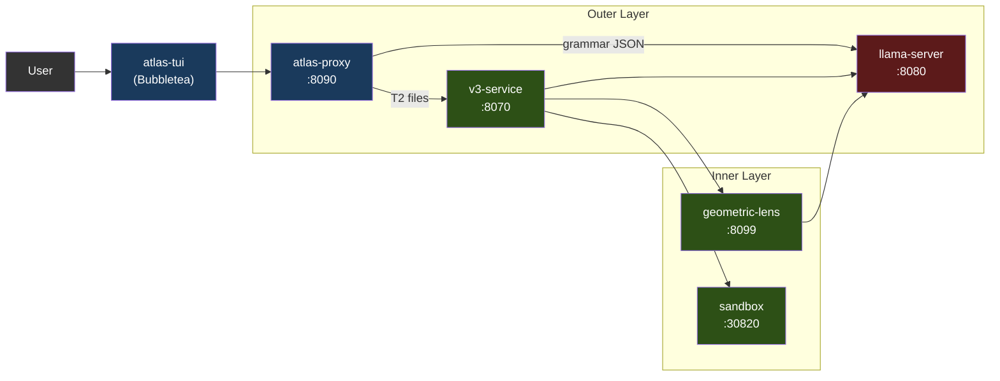
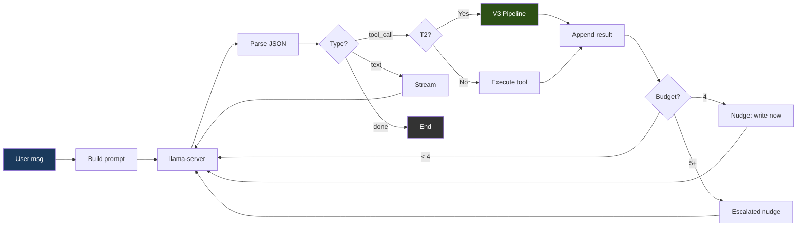
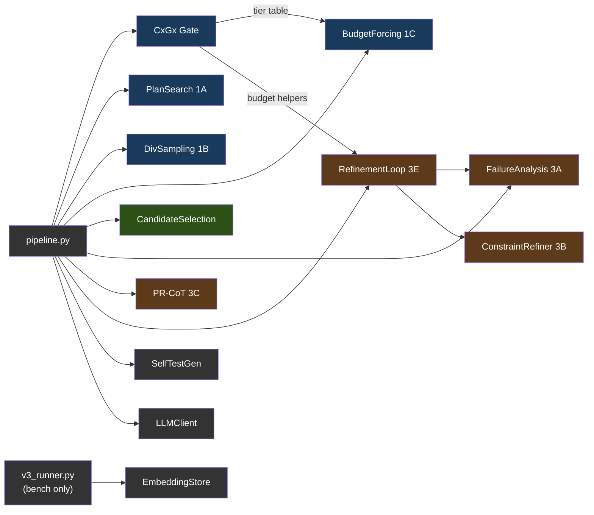
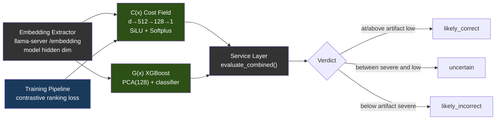
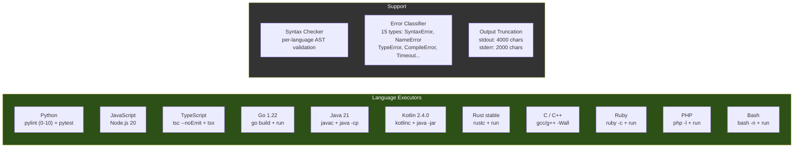
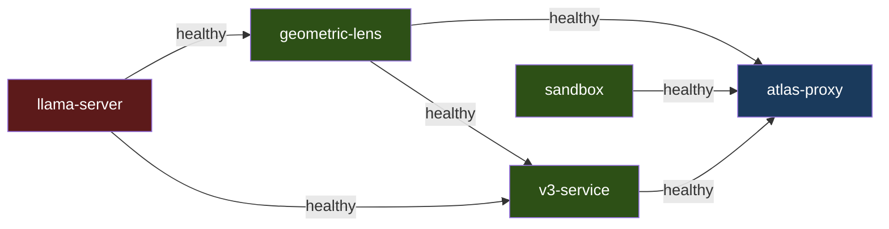
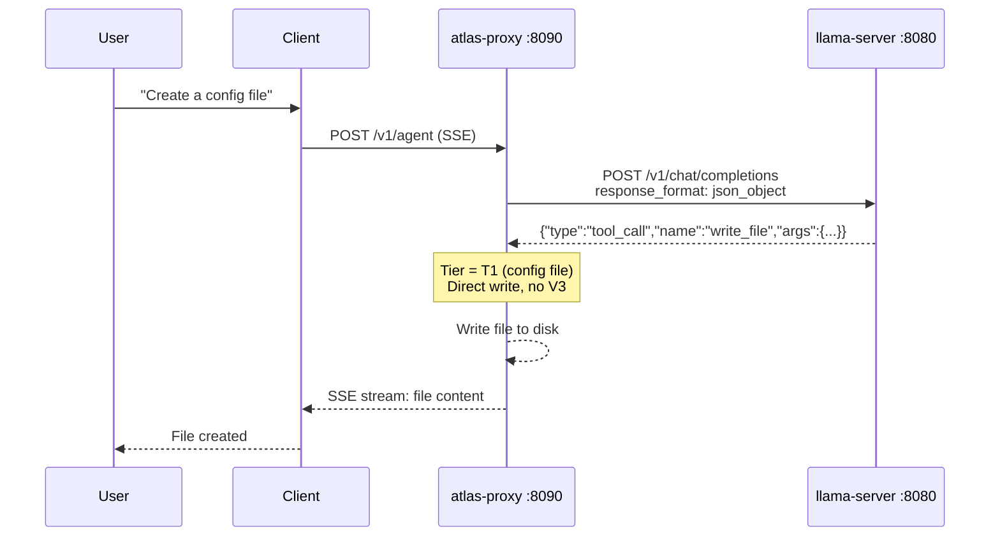
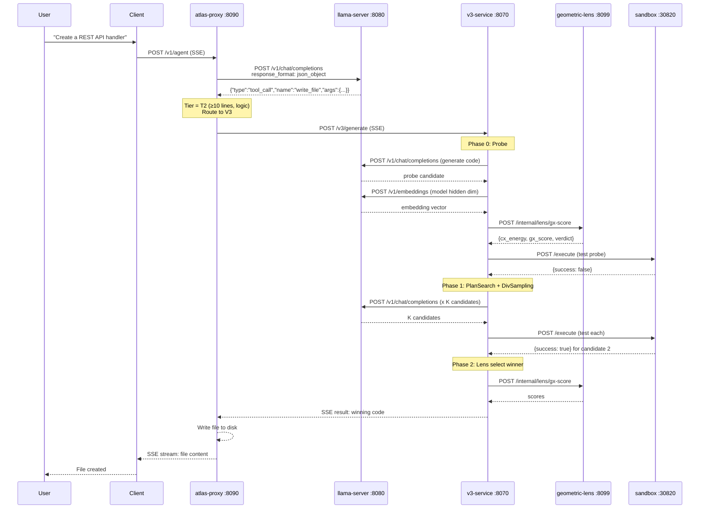
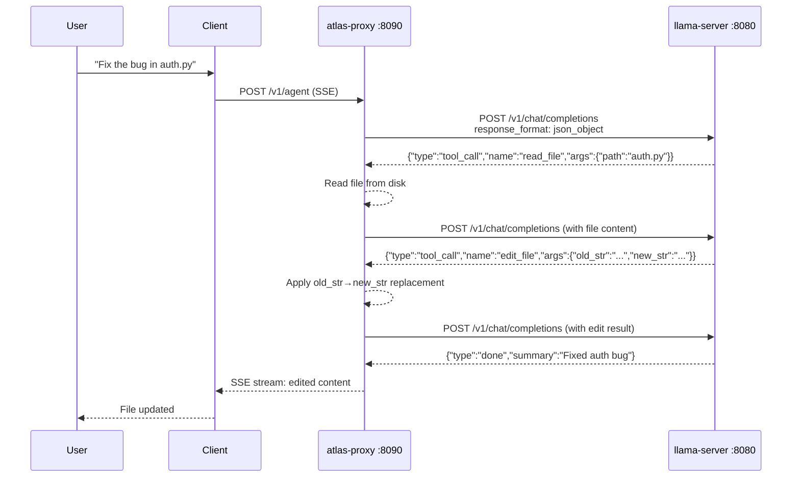

<!-- source: docs/ARCHITECTURE.md synced-through: 8d01e1fe -->
> **[English](../../ARCHITECTURE.md)** | **[简体中文](../zh-CN/ARCHITECTURE.md)** | **日本語** | **[한국어](../ko/ARCHITECTURE.md)**

# ATLAS アーキテクチャ

ATLAS V3.1.6 のシステムアーキテクチャ。二層構成: 外側のエージェントループがツールコールのオーケストレーションを担い、内側の V3 パイプラインがビルド検証とエネルギーベースの選択を通じて多様なコード候補を生成します。

---

## 1. システム概要



各サービスは Docker Compose 経由（推奨）でコンテナとして、または `atlas` ランチャー経由でローカルプロセスとして動作します。GPU を使うのは llama-server だけです。それ以外はすべて CPU 上で動きます。

チャットフロントエンドは **atlas-tui**（Bubbletea）です。ネイティブ Go 製のターミナル UI で、`/v1/agent`（ターンごとのチャット SSE）と `/events`（パイプラインペイン向けのグローバルな型付きエンベロープフィード）を消費します。`atlas`（対話モードのデフォルト）または `atlas tui`（明示指定）で起動します。パイプラインペインは V3 ステージをライブ表示し、チャットペインはアシスタントの Markdown を glamour でレンダリングします。スラッシュコマンド `/add /diff /commit /run` などがローカルファイルのコンテキストとシェルアウトを処理します。モードを意識した入力（チャット / `!bash` / `/slash`）にヒントドロップダウンが付きます。

ツールコール + V3 パイプラインを使いたいサードパーティクライアントは `/v1/agent` を直接対象にしてください。`/v1/chat/completions` は llama-server へのパススルーです（§3 を参照）。この契約は [API.md](../../API.md) に記載されています。

### 1.1 対応アクセラレータ

llama-server は GPU を使用する唯一のサービスです。それ以外のすべての ATLAS サービスは CPU 上で動作します（プロキシは Go、v3-service / geometric-lens / sandbox は Python）。これによりマルチバックエンドの対応面が小さく保たれます — 新しいアクセラレータを追加するには、新しい Dockerfile + エントリーポイントの環境変数分岐が必要なだけで、パイプラインへの変更は不要です。

| バックエンド | ステータス (V3.1.x) | イメージ / ビルドパス | Compose オーバーライド | 検証済みカード |
|---|---|---|---|---|
| **CUDA** (NVIDIA) | サポート対象 (Supported)（V3.1.0 以降） | `inference/Dockerfile.v31` → `atlas-llama` | (デフォルト) | RTX 5060 Ti 16GB（標準構成）。公開イメージは Blackwell（compute capability 12.0/12.1）のみを対象にコンパイルされており、それより前の世代はローカル再ビルドが必要 — [SETUP.md](../../SETUP.md) を参照 |
| **ROCm / HIP** (AMD) | コミュニティ検証済み (Community-tested)（V3.1.1 以降） | `inference/Dockerfile.rocm` → `atlas-llama-rocm` | `docker-compose.rocm.yml` | RX 7900 XTX（コミュニティによるスモークテスト、GH #26） |
| **Metal** (Apple Silicon) | サポート対象 ([#32](https://github.com/inferstep/ATLAS/issues/32)) | ハイブリッド: ネイティブ llama-server (Metal) + 残りは Docker（macOS は GPU をコンテナにパススルーできないため） | `docker-compose.macos.yml` | M シリーズ; 16 GB 以下では Q4_K_M、24 GB 以上のユニファイドメモリでは Q6_K |
| **Vulkan**（クロスベンダーフォールバック） | プレビュー (Preview) | `inference/Dockerfile.vulkan` → `atlas-llama-vulkan` | `docker-compose.vulkan.yml` | lavapipe の CPU 起動パス（スモークテスト済み）。実 GPU での検証はまだなし |
| **SYCL** (Intel Arc) | ロードマップ (Roadmap) — Intel Arc は現在 `vulkan` を使用 | 未定 | 未定 | — |

**バックエンドの選択は実行時ではなくインストール時に行われます。** `atlas init` は `tier.detect_gpu()`（`atlas/commands/tier.py` を参照）を実行し、検出されたすべてのベンダーの中から VRAM が最大の GPU を選び（`ATLAS_GPU_VENDOR` / `ATLAS_GPU_INDEX` でオーバーライド可能）、`.env` に `ATLAS_BACKEND={cuda|rocm|metal|vulkan}` を書き込みます。パッケージ済みのネイティブバックエンドが存在する場合、検出はそれに解決されます: NVIDIA には CUDA、x86_64 上の AMD には ROCm、macOS にはハイブリッド Metal パス。ホスト向けのネイティブバックエンドがパッケージされていない場合（Intel Arc、arm64 上の AMD、未認識のベンダー）、ウィザードは Vulkan ユニバーサルフォールバックを提案します（デフォルトは yes）: 1 つのイメージで AMD、Intel、Adreno、MoltenVK、lavapipe CPU ラスタライザをカバーし、性能はチューニング済みのネイティブバックエンドよりおおよそ 20〜40% 低くなります。起動しない `.env` を書き込む代わりに拒否するのは、使えるものが何も存在しない場合だけです。各バックエンドにはそれぞれ事前ビルド済みのイメージがあります。ユーザーがすべてのバックエンドのライブラリを同梱した肥大化したイメージを実行することはありません。

**持ち込みモデルの対応面 (V3.1.1)。** `atlas lens check` は、稼働中の llama-server に対する安価な事前チェックで、ロード済みモデルが Lens 互換かどうかを報告します。`atlas lens build --samples <path>` は `geometric-lens/geometric_lens/training.py` をラップし、モデルのネイティブ埋め込み次元で新しい C(x)（`cost_field.pt`）**と** G(x)（XGBoost）のアーティファクトをトレーニングします。この2つを組み合わせることで、ユーザーは Lens コードをフォークすることなくデフォルト以外の GGUF を差し込めます — C(x) コンストラクタは任意の `input_dim` を受け付けるため、モデルごとに変わるのはトレーニング済み重みだけです。ユーザー向けのフローは [CLI.md § atlas lens](../../CLI.md#atlas-lens) を参照してください。`atlas lens publish`（または統合コマンドの `atlas publish`）がアーティファクトを HuggingFace にアップロードし、そのハッシュを固定するレジストリ PR を開きます。

**ベンダー非依存な要素**（すべてのバックエンドで動作）: 文法制約付き JSON、セルフ埋め込み（`/embedding`）、レイヤーごとの隠れ状態、ASA 制御ベクトル（バックエンドを問わず llama.cpp の `control_vector_load` でロードされる）、KV キャッシュ量子化、外側のエージェントループ全体、V3 パイプライン、Geometric Lens、サンドボックス。

**バックエンドごとに異なる要素:**
- **Flash attention。** CUDA + ROCm: 完全サポート。Metal: 限定的（llama.cpp の Metal バックエンドは一部のヘッドサイズで flash-attn をサポート。未対応の場合はデフォルトでオフ）。Vulkan: ドライバ依存。
- **ピン留めホストメモリ。** `GGML_CUDA_NO_PINNED` は CUDA + ROCm に適用されます（HIP は GGML 互換レイヤーで CUDA のパスをミラーします）。Metal/Vulkan は CUDA/HIP のピン留めパスを使いません。
- **マルチ GPU + テンソル並列。** V1 はすべてのバックエンドでシングル GPU のみをサポートします。マルチ GPU は GH #34 で、特定のベンダーに紐づいてはいません。
- **Apple ユニファイドメモリ。** macOS は GPU とシステムメモリを共有します。「VRAM」の計算は実際には「合計 16 GB から OS + アプリを引いたもの」です。§7 を参照してください。

K3s デプロイパス（`scripts/install.sh`、`templates/` 内のマニフェスト）は V3.1.1 時点では CUDA 専用です — ROCm の K8s レシピは V3.2 のインフラ項目に延期されています（`/dev/kfd` + `/dev/dri` の hostPath マウントと `render`/`video` グループ所属が必要で、これは `docker-compose.rocm.yml` のクラスターレベル相当です）。

---

## 2. サービス

| サービス | ポート | 言語 | 役割 |
|---------|------|----------|---------|
| **llama-server** | 8080 | C++ (llama.cpp) | LLM 推論（CUDA / ROCm / Metal / Vulkan; SYCL はロードマップ — §1.1 を参照）、文法制約付き JSON、セルフ埋め込み、レイヤーごとの残差隠れ状態 |
| **atlas-proxy** | 8090 | Go | エージェントループ、ツールコールルーティング、ティア分類、`/v1/agent` SSE、`/events` 型付き SSE、`/cancel`。`/v1/chat/completions` は、`max_tokens` のクランプのみを適用して llama-server へ転送します（API.md を参照）。 |
| **atlas-tui** | (クライアント) | Go | Bubbletea TUI; `/events` と `/v1/agent` の SSE ストリームを消費。 |
| **v3-service** | 8070 | Python | V3 パイプラインの HTTP ラッパー（PlanSearch、DivSampling、PR-CoT など） |
| **geometric-lens** | 8099 | Python (FastAPI) | 内部 `/internal/*` スコアリングサービス: C(x) エネルギースコアリング、G(x) XGBoost 品質予測、ステップごとのスコアリング |
| **sandbox** | 30820 (ホスト) / 8020 (コンテナ) | Python (FastAPI) | 分離されたコード実行、コンパイル、リント、テスト実行 |

---

## 3. atlas-proxy（外側のレイヤー）

プロキシはチャットフロントエンドのエントリーポイントです。`/v1/agent`（型付きイベントストリーム — TUI が使うもの）でユーザーメッセージを受け取り、llama-server を呼び出し、ツールコールをパースし、それらを実行し、イベントをストリームバックする内部エージェントループを実行します。`/v1/chat/completions` エンドポイントは llama-server への透過パススルーです。SDK 互換性のために残してあり、エージェントループは実行しません。イベントタイプの完全なカタログは [API.md](../../API.md) を参照してください。

`proxy/` 直下の非テスト Go ファイルすべてと、それぞれの担当領域:

| ファイル | 担当 |
|---|---|
| `main.go` | HTTP サーバー、ルーティング、認証、パススルー、エラーエンベロープ、秘匿値のログフィルタ |
| `agent.go` | エージェントループ: ターン状態、LLM 呼び出し、プラン生成、スタックループのブレーカー |
| `tools.go` | 16 個のツール定義 + 実行系、ティア分類、ツールコール文法 |
| `gates.go` | 誠実性 / プランゲート: クレームチェック、構造、構文、埋め込みスクリプト、プラン遵守、プランリマインダ、アセットリント |
| `detectors.go` | スタックパターン検出: ツールの繰り返し、推論の繰り返し、トレースバックの局所化 |
| `context.go` | コンテキストの拡充: シンボルインデックス、プロジェクトスキャン、ワークスペース封じ込め、セッションファイルマニフェスト |
| `permissions.go` | パーミッションゲート（`/v1/permission`）、トラストモード、ハードブロックされたパターン |
| `lens.go` | レンズのスコアリング呼び出し、各検証実行（合格・失敗を問わず、その証拠種別とともに）に対してループが保持する `VerificationRecord`、キャリブレーション状態 |
| `lens_identity.go` | レンズサービスへの直接呼び出しに使う、プロキシ所有の呼び出し識別子を作成して付与する |
| `lens_required.go` | Geometric Lens が利用可能であることを強制し、Lens の失敗を追跡し、スコアリング不能なときに実行を停止する |
| `logsafe.go` | ログ向けのプライバシーセーフなツール引数サマリを構築する。承認済みフィールドのみを許可し、機微な内容をマスクする |
| `memory_envelope.go` | 宣言されたデプロイのメモリ予算をオペレーター申告のホスト容量と照合し、未強制の予算超過を報告する |
| `object_handle_linux.go` | 削除承認の間、Linux のファイルシステムオブジェクトを開いたまま保持し、承認されたオブジェクトが除去前に差し替えられないようにする |
| `object_handle_other.go` | 非 Linux プラットフォームでは、ファイルシステムオブジェクトを安全にピン留めして検証できないため、削除承認を拒否する |
| `mutation_scope.go` | モデルのツールコールから正確なファイル・編集スコープを導出し、候補が要求対象以外を変更できないようにする |
| `obligation_kinds.go` | 閉じた義務タイプの集合、必要な証拠の強度、各義務がどう充足されるかを定義する |
| `obligations.go` | 実行の義務が呼び出し側の宣言した契約と ATLAS のレガシー推論のどちらに由来するかを選び、その決定をリクエストに束ねたまま保つ |
| `command_evidence.go` | シェルコマンドが何を実証するか: 実行、プローブ、静的チェック、または無。またコマンドラインがその部位の終了ステータスを報告するかどうか |
| `guardrails.go` | ツールごとのステアリングガード（縮約、コマンド/モジュール欠落のステア、doctype 除去） |
| `events.go` | 型付きエンベロープのブローカー（`/events`）と SSE の配管 |
| `v3_bridge.go` | v3-service の `/v3/generate` + `/v3/plan` 向け SSE クライアント |
| `types.go` | 共有型、ティア、ターン上限 |
| `advisory_policy.go` | モデルの提案を保持するか候補を配信するかを決定する。検証と選択ルールの前にハード拒否権を適用する |
| `authorization_decision.go` | 候補の証拠がタスクの認可要件（対象スコープと、既存ファイルの検証済み挙動の保存を含む）を満たすかチェックする |
| `authorization_grant.go` | 正確な候補・対象・ワークスペース状態に束ねられた一回使い切りの許可を作成・消費・退役させる |
| `automatic_attribution.go` | 自動候補配信が成功・拒否された理由を、ルート/認可/ポリシー/配信の各担当者が既に下した決定を使って記録する |
| `automatic_delivery.go` | V3 が選択した正確な候補が自動配信の安全性・識別要件を満たすかチェックする |
| `candidate_capture_only.go` | キャプチャ専用の計測実行中は候補配信を防ぎ、その抑制を記録する |
| `candidate_delivery.go` | 候補配信を認可し、その一回使い切りの許可を消費し、現在のワークスペース状態を再チェックし、承認されたバイトを書き込む |
| `candidate_policy.go` | 固定の候補ポリシー、その取り得る結果、各決定の非公開記録を定義する |
| `candidate_provenance.go` | 配信された内容がどこから来て、どのポリシーがディスクへの到達を許可したかを報告する |
| `candidate_reachability.go` | ミューテーションが候補生成をバイパスした理由（適格性と残り時間を含む）を判定・記録する |
| `candidate_staging.go` | 分離されたサンドボックスのコピー内で、クライアント宣言の検証コマンドを候補ファイルに対して実行し、返された観測をチェックする |
| `cut_call.go` | 切り詰められたツールコール内の完全なフィールドと現在のファイルから、不完全なコールを実行せずに回復ガイダンスを構築する |
| `delivered_handoff.go` | 配信された内容がモデルが提出したものと異なるとき、モデルのファイルコンテキストとツールフィードバックを更新する |
| `delivery_settlement.go` | 完了した候補配信を記録し、認可された成果物が一致するバイトと台帳状態でまだ存在するかチェックする |
| `edit_route_delivery.go` | 編集ツールの候補を認可と配信に通し、発元ツールの結果形式とフォールバック内容を保持する |
| `evidence_wiring.go` | 構文と宣言コマンドの証拠生成者を候補ルートに接続し、候補識別子を割り当て、利用可能・欠落の証拠を記録する |
| `execution_outcome.go` | コマンドの完了・中断・リソース枯渇を分類し、不完全な実行が成功した検証として数えられないようにする |
| `exploration_budget.go` | 読み取り専用コールの反復の後、リクエストが要求するものに応じて実行に行動か応答を促す |
| `feasibility_decision.go` | 生成の前に、利用可能な証拠生成者がタスクを充足できるかを評価し、生成を制御せずにその評価を記録する |
| `fenced_framing.go` | 完全なフェンス済みファイルペイロードを認識し、その内容を抽出し、フレーミング文法とリトライガイダンスを供給する |
| `old_str_watch.go` | ストリーミング中の編集テキストが対象ファイルに一致できなくなった時点で暴走を止め、回復ガイダンスを供給する |
| `repair.go` | セッションの書き込みが残した未解決の構文リペアを追跡し、 premature な完了をブロックし、ハンドオフ時に未解決のリペアを報告する |
| `reply_lead_ins.go` | 序文のフレーズを正規化し、完了チェックが将来の作業を告知するだけの応答を認識できるようにする |
| `route_disposition.go` | 各候補ルートがどう終わったか、その配信許可が内容のディスク到達に至ったかを追跡する |
| `route_entry.go` | 各候補生成の試行に一意の識別子を作成し、その証拠・認可・配信の記録をリンク可能にする |
| `staged_command_evidence.go` | 候補のバイト・ワークスペース・配信が最新である間のみ、ステージング済み検証を完了に対してクレジットする |
| `staging_contract.go` | サンドボックスのステージングリクエスト・観測・実行予算とその識別子束ねを定義・検証する |
| `structured_mutation_target.go` | クライアントが出力パスを宣言していないとき、パースされたミューテーションコールが候補配信を正確な対象に接地しているかチェックする |
| `syntax_evidence.go` | プロキシの構文チェック観測を、正確な候補バイトと構造的義務に束ねられた証拠に変える |
| `v3_delivery_registry.go` | サービス作成の候補内容を配信してよい本番ルートと発元ツールのリスト |
| `v3_fallback_note.go` | V3 が失敗・タイムアウトした後に書かれたファイルを追跡し、最終サマリでまだ現行の未チェック内容を開示する |
| `verification_evidence.go` | クライアント宣言のコマンド観測から証拠を生成し、それが個々の検証義務のどれを充足するかを追跡する |
| `verification_requirements.go` | 型付きのクライアント検証要件を検証し、宣言されたチェックとテスト資産の出自に応じて証拠の強度を制限する |
| `workspace_observation.go` | フォアグラウンドとバックグラウンドのコマンドが行ったファイル変更を観測し、成果物と削除をセッション台帳に記録する |

### エージェントループのフロー



### 文法強制

すべてのモデル出力は、3つの有効な JSON 形状のいずれか1つへと制約されます:

```json
{"type": "tool_call", "name": "<tool_name>", "args": {...}}
{"type": "text", "content": "<message>"}
{"type": "done", "summary": "<summary>"}
```

デフォルトの `strict` モードでは、プロキシは完全な JSON スキーマ — `oneOf` と `additionalProperties: false` を用い、ツール名をレジストリから列挙したもの — を送信し、llama-server がそれをトークン生成中の文法として強制します。文法制約は不正な出力を稀にしますが、不可能にはしません: `ATLAS_GRAMMAR_MODE=loose` は `{"type":"json_object"}` のみを送信し（有効な JSON にはなるが形状は強制されない — 一部のモデルはこれを必要とします）、応答トークンの上限が JSON の途中で切り詰めることもあります。プロキシはパースを失敗し得るものとして扱います — 散文や `reasoning_content` から JSON を回復し、切り詰められたツール引数を実行前に検出し、的を絞ったパース失敗の説明をフィードバックし、3連続失敗でループを打ち切ります。

**フェンスされたコンテンツのチャネル（`@fenced`）。** ファイル全体の本体は JSON チャネルには載りません。JSON 文字列内のコードは密度の高いすべての行でエスケープの圧力を支払い、サーブされる 12B はそれを持続できないことが計測されています: 同じ解答が、フェンスされた markdown ブロックとして出力された場合は 6/6 でパースされ、JSON 文字列として出力された場合は 0/6 でした（閉じ括弧の欠落、リテラルの `\n` が文をコメントへ融合、join が空白を失う）。システムプロンプトはモデルに `write_file` の `content` を正確に `@fenced` に設定するよう指示します。プロキシは次に、*制約なしの*サブコール（文法なし、`response_format` なし）を1回行い、その応答はターゲット拡張子のタグが付いた単一のフェンスブロック内のファイルです。エンベロープは JSON 制約の下に留まり、ファイル本体だけがプレーンテキストへ移ります。メカニズムの詳細（`proxy/agent.go::fetchFencedContent`）: サブコールはエフェメラルです（会話には決して追加されない — メインスレッドから見れば、モデルは `@fenced` と書き、書き込みが起こったように見えます）。ファイル自体が ` ``` ` を含む応答は、末尾フェンスアンカーによって抽出され、内部のフェンスで切断されることはありません。センチネル*と*ファイルを1つの文字列に入れたモデルには、センチネルが剥がされ、インラインの内容が使われます。2回試行した後は、インラインでの提出を求めるバウンスが返ります。すべての試行は実際の生成であり、実行の合計に計上されます（最終 `done` ペイロード上の `fenced_calls` / `fenced_tokens`、試行ごとに1つの `fenced_fetch` ステージイベント）。

繰り返し検出器は、フェンス解決が `parsed.Args` を取得済みの本体で書き換える前の、ツールコールブランチの先頭でスナップショットされた、**モデルが送信した**コールをフィンガープリントします。このスナップショットがなければ、検出器は、コール自体はバイト同一であるにもかかわらず、試行ごとに異なるバイトを読むことになります。凍結された実行で7ターンの `@fenced` ループが、検出器を沈黙させたままハーネスの上限に到達したのはこのためです。取得されたバイトには影響ありません: それらは引き続き、ミューテーション、ゲート、台帳、書き込みを駆動します。ターゲットパスはシグネチャのために正規化されるため、`solve.py` と `./solve.py` が別々の予算を得ることはありません。

あるパスのフェンス許容量が尽き、モデルがそのチャネルを再度要求した場合、拒否は一度だけ、モデルが行動に移せる形で行われます: 正規パス、ファイルが読み取り可能な場合の現在のソース（上限付き、またはディスク上にないことの明示的な注記）、そしてまだ機能する代替手段 — ファイル全体のインライン、的を絞った編集、読み取り、またはモデル発行の `run_command`。正規パスごとに1回だけ提供されます。エイリアス、新しいターン、無関係な成功がそれを再開することはできません。生成を開始せず、コマンドを実行せず、ツールを強制もしません。要求し続けるモデルは、通常の失敗コールの会計に出会って停止します。

run-first ゲートが既に警告済みファイルの実行を要求したのに、モデルが同じ生の `@fenced` 書き込みで応答する場合、その要求を繰り返すのはメカニズムではありません。その再発時、モデルにはファイルのあるがままの姿が手渡されます — 正規パス、最大120行の番号付き行、そして台帳がそれらの正確なバイトについて失敗判定を保持している場合はその判定 — そして無駄なコールは差し止められます。フェンス解決の前に実行されるため、ブロックされた繰り返しは生成を消費しません。読み取りのみで書き込みはせず、コマンドを実行せず、ツールを強制せず、正規パスごとに最大1回発火し、作業予算の残りが 90 秒未満の場合はスキップされます。モデルがブロックされた意図をそれでも繰り返す場合、既存の禁止と繰り返し検出器が実行を誠実に終了させます。

run-first ゲート自体は1つの指示 `runFirstInstruction` を引用します: その拡張子のファイルを実行するコマンド（`runCommandFor`: `python3`、`node`、`go run`、`java`、または Kotlin 向けの `kotlinc … && java -jar` のペア）で、終了するスクリプトは `run_command` 経由で、サーブするスクリプトは `run_background` 経由で送られます（フォアグラウンドサーバーのリダイレクトが使うのと同じ `runsAServerLoop` チェック）。どちらのツールも、そのコマンドがファイルを実行すれば警告マークを解消するため、バックグラウンドで開始され、セトルウィンドウのトレースバックで読み取られたサーバースクリプトは実行されたと数えられます。`python3 -m <module> file.py` と `python3 -c ...` はファイルを別のプログラムに渡すため、そのサーバーループの開始として扱われることは決してありません。これら3つのルール以前の 2026-09-14 の計測: ゲートは `run_command python3 app.py` を要求し、リダイレクトはそれを拒否し、`run_background` はマークを解消せず、`python3 -m py_compile app.py` はサーバー開始として拒否され、セッションは SyntaxError をディスクに残したまま終了しました。

各試行が1回の生成を消費するため、チャネルは実行可能なコールに対してのみ開かれます。`fencedCallIsExecutable` は、コールがいずれにせよ生き残らなければならないチェック — 引数の形状、非空白のパス、`validateToolWorkspacePaths`、`shouldDenyToolCall` — を実際に呼び出すことで実行するため、その拒否は `executeToolCall` の拒否の部分集合になります。使えないコールは単純に解決されません: センチネルは `content` に留まり、ツールは自身のメッセージと `MutationNone` でそれを拒否し、セッションは生成ではなく1ターンを消費します。このチェックが存在する前の計測: 300 秒のカナリアは、何も書かずにターン36に到達しました。すべてのターンが `content: "@fenced"` でパスのない `write_file` で、それぞれがチャネルを開き、それぞれの失敗が空パスの許可キーに対して記録されていました。

フェンスされたサブコールは停滞することがあります: ストリームが開き、サーバーが見えないところで生成している間、何も送信しません。ウォッチドッグがそれを切断します（`fencedStalledTimeout`、約 25 秒）。停滞はファイルではなくセッションの性質であるため、あるファイルの取得が停滞すると、次のファイルの取得も同じように停滞します。最初の停滞した取得の後、チャネルは実行の残りの間オフにされます（`ctx.FencedStalls` が `fencedSessionStallLimit` を超えた場合。`fencedChannelDisabledForSession` でテスト済み）: 次の `@fenced` はサブコールなしで即座に返り、モデルはファイルをインラインで書くようステアされます。インラインは安全なフォールバックです。下記の書き込み整合性チェックが、`@fenced` が当初回避するために存在していた切り詰めを今は捕捉するためです。

### 書き込み整合性チェック

3つのチェックが、壊れたファイルがクリーンな書き込みとして着地するのを防ぎます。それぞれが本当の原因を名指しするため、モデルの再送がそれを修正できます。

**エスケープされていない引用符で短く切られた書き込みは拒否されます。** `content` がエスケープされていない `"` を含む `write_file` は、その JSON 文字列を早く終わらせます。寛容なデコーダはファイルの残りを破棄されたキーに読み込み、成功を報告する切り詰められたファイルを着地させます。ループは、パースされた編集ツールのコールに対して、ツールの実際のシグネチャの外側にあるキー（入力スキーマからリフレクションで読む）で、リークしたファイル内容の形状 — 長い、またはコードの句読点を含む — を持つものをチェックし、それを拒否します（`swallowedContentFeedback`）。文字列が早く終わったこと、内部の引用符をエスケープするか `structural_edit` を使うようモデルに伝えます。

**レンダーのたびに 500 になる Jinja テンプレートは書き込み時に捕捉されます。** テンプレートは HTML としてパースできてもレンダーで失敗することがあります: `{% for x in xs %)` はタグを `)` で閉じます。`html.parser` はそれを通過させてサーバーは起動しますが、すべてのレンダーが `TemplateSyntaxError` を発生させます。サンドボックスの構文チェックは Jinja もパースしますが、実際にテンプレートであるファイル（`templates/` ディレクトリまたは `.jinja`/`.jinja2` という名前）に範囲を限定し、`{%` ステートメントタグが存在する場合にのみ行われるため、`{{ }}` を共有する Vue/Angular の HTML が Jinja パーサに渡されることはありません。未知のタグ/フィルタのエラー（サードパーティ拡張）は破棄されます。プロキシはファイルパスを送るため、サンドボックスは、直接書き込みゲートと V3 のコンパイルスモークチェックの両方でその範囲を適用できます。

**ベースラインが既にコンパイルされる場合、インタラクティブなタスクは V3 の修復をスキップします。** V3 の修復フェーズに到達するのは、生成された候補が1つも合格しなかった場合だけです。インタラクティブなタスクで唯一のシグナルは「コンパイルできるか」であり（サーバーはサンドボックス内で完走できないため）、その時点で唯一コンパイルできるコードはモデル自身の書き込みであり、修復してコンパイルできるようになった候補は、コンパイルできるベースラインよりも良く検証されたことにはなりません。ベースラインがコンパイルされる場合、修復はスキップされてベースラインが返され、セッションの約 50% を再導出に費やす代わりに予算がエージェントループに返されます。アルゴリズム的なタスクは修復を維持します: それらは実行でき、そのモデル生成のセルフテスト結果は診断として記録されます。


### ツール

`proxy/tools.go` に登録された16個のツール:

| ツール | 役割 | 読み取り専用 |
|------|---------|-----------|
| `read_file` | ファイル内容を読む（任意の offset/limit 付き） | はい |
| `outline_file` | ファイルのトップレベルの関数/クラスを行範囲付きで一覧表示し、本体は含めない（`.py` は tree-sitter、それ以外はベストエフォートのスキャン）。全体を読むには大きすぎるファイル内の対象を位置特定する: まずアウトラインし、次に offset/limit 付きで `read_file` する。コードを返さないため、診断を接地できない — `read_file` がデフォルトのエントリーポイント | はい |
| `write_file` | 新規ファイルを作成（既存の5行超ファイルでは拒否 — 安全制限を参照） | いいえ |
| `edit_file` | ≤10 行の変更向けの外科的なインライン文字列置換（old_str/new_str） | いいえ |
| `insert_after` | 指定した行番号（`read_file` が表示する行番号）の後ろに新しい行を挿入する。何も既存のものを変えずにコード（分岐、関数、import）を**追加**する場合向け: 再現すべき `old_str` がなく、長いスパンで失敗するのはまさにその工程 | いいえ |
| `replace_lines` | 行範囲（`start_line`..`end_line`、`read_file` が表示する行番号）を新しい内容で置き換える。コードを再現せずに**変更**する場合向け: アンカーはスパン全体ではなく主張された2行（範囲の先頭行と末尾行、空白は無視）なので、逐語での再現負担は N 行ではなく 2 行になる。1回の呼び出しにつき最大60行 | いいえ |
| `structural_edit` | tree-sitter セレクタ（`function:NAME`、`class:NAME`、`<tag>`）による関数/クラス/HTML 要素全体の書き換え; ノード全体の差し替えでは edit_file より優先して必須。GH #39、v1 では .py/.html/.htm のみ | いいえ |
| `delete_file` | ファイルまたは空ディレクトリを削除（実行後にループ終了を強制） | いいえ |
| `move_file` | ワークスペース内でファイルを移動またはリネーム（例: `index.html` → `templates/`）。純粋な移動 — V3/外科的編集のゲートをバイパスし、既存の宛先の上書きは拒否。シェルの `mv`/`cp` が拒否されるため「ファイルを再編成する」ための正規のパス | いいえ |
| `find_file` | ファイル**名** / パスによる正規表現検索（安価な存在確認 + 位置特定）。ファイル内容を grep する `search_files` とは区別される。 | はい |
| `search_files` | ファイル内容にまたがる正規表現検索（最大200件、.git/node_modules をスキップ） | はい |
| `list_directory` | ディレクトリ内容を種別とサイズ付きで一覧表示 | はい |
| `run_command` | サンドボックスコンテナ経由でシェルコマンドを実行; 5分のタイムアウト上限。シェルがまったくパースできないコマンドは、実行できなかった理由を返します: 原因が `-c`/`-e` の後ろにインラインで引用されたプログラムである場合、拒否はそのスニペットをファイルに書くようリダイレクトします。生の `syntax error near unexpected token` はモデルに変更すべきものを何も与えず、同一の行を再送させるためです | いいえ |
| `run_background` | サンドボックス内で長時間実行プロセス（例: `python app.py`）を開始; `job_id` を即座に返す | いいえ |
| `tail_background` | バックグラウンドジョブの新しい stdout/stderr を `job_id` で取得 | はい |
| `stop_background` | バックグラウンドジョブを `job_id` で SIGTERM/SIGKILL | いいえ |

### 成果物台帳（観測的）

`executeToolCall` は、各コールがセッションの成果物に何をしたかを、解決済みワークスペースパスをキーとした `AgentContext.Ledger` に記録します。観測はしますが、決定はしません: 復元も拒否もイベントもありません。`ToolEffect` が扱いを選びます。

| 効果 | 記録される内容 |
|--------|------------------|
| 直接ミューテーション（`write_file`、`edit_file`、`structural_edit`、`insert_after`、`replace_lines`） | コール後にファイルが再読み取りされてハッシュ化されるため、記録されたハッシュはツールが提案したバイトではなくディスク上のバイトを示す |
| `delete_file`、`move_file` | パスが実際に消えた時点でトゥームストーンを1つ置き、チェックポイントバイトがあれば保持し、自動復元を禁止。移動は宛先を新規に観測し、判定を引き継がない |
| `run_command` | 追跡対象のすべてのパスが再ハッシュ化される: 変更のないファイルは判定を保持し、変更されたものは判定を失う。ワークスペースはコマンドの前後でもウォークされる（`applyShellChanges`、stat のみ、依存・キャッシュ・ビルドディレクトリをスキップ）: 完了が判断できる種類のファイルで、コマンドが作成または変更したものはセッションの作業として台帳に入る。リクエスト開始時に存在していてコマンドが削除したファイルは `deleted:shell` としてトゥームストーン化され、完了はそれを誰も承認していない削除として読む。実行が作成し、後のコマンドが削除したファイルは台帳から離れる。上限に達したウォークはサマリに注意書きを残す |
| `run_background`、`stop_background` | 開始時にワークスペースハザードが上がり、回収された終了コードでのみ下がる。各コールは `run_command` と同様に前後でウォークされ、最初のライブジョブを開始したコールの後のウォークがベースラインとして保持される。ジョブがもう書き込みできない時点で（完了が終了ジョブを回収する、`stop_background` が終了を確認する、またはセッションが最後にジョブを回収する）、ワークスペースは同じルールの下でそのベースラインと比較される。台帳が既に記録している削除（`delete_file`、`move_file`、以前のウォーク）はジョブに課されない |

何もミューテートしなかったと証明されたブランチ（`MutationNone`）は何も記録しないため、セッションが一度も所有したことのないパスへの拒否された書き込みは台帳に入りません。

`ValidationKind`/`ValidationStatus` はツール自身の結果からコピーされ、それらが記述するハッシュに束ねられます。`CurrentValidation()` は、ファイルのハッシュが検証済みのものから離れた時点で直ちに unknown を返します。バイトは、その正確なハッシュに対する明示的な `passed` の場合にのみ、ファイルあたり 256 KiB・セッションあたり 2 MiB の上限の下でチェックポイントされます。上限を超えると、観測は保持されますがバイトは保持されず、`checkpoint_unavailable` がその理由を記録します。

どのミューテータがチェックポイントを残せるかは、それらが書き込んだバイトに対して明示的な合格を生成できるかから従い、`TestWhichMutatorsCanEverPromoteACheckpoint` によって計測されます:

| ツール | `passed` に到達 | 備考 |
|------|------------------|------|
| `write_file`、`edit_file`、`insert_after`、`replace_lines` | はい | 構文ゲート経由（サンドボックスが到達可能な場合） |
| `structural_edit` | いいえ | tree-sitter のスプライスは v3-service のもの。このツールは書き込むバイトに対して独自のチェックを行わないため、`syntax`/`not_run` を報告する |
| `delete_file`、`move_file` | いいえ | どちらも内容を変えないため、与えるべき判定がない |

7つのミューテータのすべてのブランチは独自の `MutationStatus` を持ちます: 境界は直接ミューテータを分類することを構造的に禁止しているため、未分類のブランチは意図的な no-op と区別がつかなくなります。`noMutation` / `errNoMutation` は書き込むバイトを形成しなかったブランチを、`refusedNoCheck` は準備ができていたバイトを拒否したガードを、`errFailedMutation` は試行されたがターゲットを不確定なままにした書き込みを示します。`TestEvery*OutcomeIsClassified` がファミリーをカバーします。

#### モデルに見えるもの

分類はサーバー側の事実です。`ToolResult.ModelFacing()` は結果を `success` / `data` / `error` と V3 出自フィールドへ投影し、`MarshalText` — 結果から `ctx.Messages` への唯一の経路 — はそれを通ります。完全な構造体は内部利用のためにすべてのフィールドでマーシャルされ続けます。投影は許可リストであるため、`ToolResult` に追加されたフィールドは、誰かが別の決定をしない限り会話には入りません。

3つのテストが `proxy/result_contract_test.go` と `proxy/tool_effect_test.go` でこの境界を保持します: `TestEveryModelFacingSerializationSiteIsInventoried` は、新しい直接マーシャルや、目録化されていないルートで構築されたツールメッセージに対して失敗します。`TestModelFacingTextCarriesNoClassification` は結果ごとの投影バイトを固定し、`TestModelPromptBytesAreUnchangedByClassification` は、分類が変わった2つのブランチに対してエージェントループを実行し、リクエストボディを親コミットと比較します。

2つの制限は抱えているものであり、推論で回避されるものではありません。`structural_edit` は成功時に `syntax`/`not_run` を報告するため、チェックポイントを昇格できません。`move_file` のクロスファイルシステムのコピーパスは本番で到達可能ですが、1つの一時ディレクトリは2つのファイルシステムにまたがれないため、本番パスのテストがありません。

#### 復元

1つのターミナルだけにリカバリが接続されています: 繰り返し検出器の停止。それは、実行が壊れていると自ら示した成果物を保持したまま終了する場所です。他の12の `done` エミッタは手つかずです — 何も実証しなかったターミナルには復元すべきものがない — そして `TestRestorationIsWiredToExactlyOneTerminal` は、それが広がった場合に失敗します。

そのターミナルで、各成果物は再読み取りされ、書き込みパスが使うのと同じ構文契約を通して再チェックされ、それ自体で判断されます。すべての条項は行動しない理由です:

| 必要 | 拒否される条件 |
|----------|---------------|
| このセッションがそのパスを書いた | それはここでは一度も成果物ではなかった |
| 現在のバイトが新たに再読み取り・再チェックされている | チェッカーが実行できず、判定が不明 |
| その正確なハッシュが実証された失敗を保持している | 現在の内容がパースされる、または一度もチェックされなかった |
| 保持されたバイトが存在し、範囲内で、自身の記録にハッシュ一致する | 退避された、上限超過、または自己矛盾 |
| 保持されたバージョンが同じ種類のチェックに合格している | 構造的な合格は構文についての証拠ではない |
| 2つのバージョンが異なる | ファイルは既により安全なバージョンを保持している |
| トゥームストーン化されておらず、復元禁止でもない | モデルが意図的に削除または移動した |
| ライブのバックグラウンドハザードがない | バックグラウンドジョブがまだ書き込み中の可能性がある |

書き込みは `atomicReplaceFile` — ミューテーションツールが使うのと同じ write-then-rename — を通って行われ、結果は再読み取りされてハッシュ化されます: 正確に着地したことを証明できない復元は、本物のエラーを保持して現在のバイトをそのままにする失敗です。リカバリは進行のヒントを設定せず、セッションの書き込みを登録せず、ツールイベントを発行せず、V3 の出自を主張せず、停止された実行を完了されたものに変えることは決してありません — サマリは、パスごとに、どのファイルが戻されたか、どれがそのままにされたかとその理由、どれが復元できなかったかを、それらが一緒に動いたという含意なしに開示します。

#### ターミナル契約とセッション予算

すべてのセッションは、1つのエミッタから発せられるちょうど1つのターミナルイベントで終わります。それはレガシーの `summary` を変更せず運び、加算的な `status` — `completed`、`incomplete`、`stopped`、`timed_out`、`failed` — と安定した機械可読な `reason` を伴います。消費者は、不在・不正形式・未認識の値を完了ではなく `incomplete` として読みます（Go の `NormalizeTerminalStatus`、`atlas/events.py` の `terminal_status`）。ブローカーの `done`/`stage_end` エンベロープは、`success: true` を主張する代わりに同じ結果を報告します。

`completed` 以外のすべてのステータスについて、サーバーはフィールドと同じくその文も所有します。モデル自身の説明が通されるのは、完了ゲートがそれを認可した場合のみです。サマリのない非完了ターミナルには、結果・ディスク上に何かが存在するか・それが有効と示されたかを名指しするサーバー作成のサマリが与えられ、非完了ステータスでエミッタに到達した完了の主張は、周囲を編集するのではなく全面的に差し替えられます。これによりフェーズ 2B が残したギャップが閉じられます: `summary` だけを読むクライアント — `status` が存在する前に書かれたすべてのクライアント — は今、両方を読むクライアントと同じ真実を読みます。

実行前のワークスペース境界チェックに拒否されたコールは、それがそうであるもの — 失敗コール — として数えられます。そのため、ワークスペースルートを開けないセッションは、予算が尽きるまで同じ拒否を繰り返す代わりに3ターンで停止します。`workspacePathFields` は、各ツールがどの引数をパスとして扱うかの唯一のレジストリで、テストは2つ目のコピーを保持せずそれを列挙します。

ワークスペースハザードは、開始試行の回数ではなく、ジョブ識別子をキーとした集合です。ツールがディスパッチ前に拒否した `run_background` は何も所有しません。ライブのジョブは、重複した id では二度上げられない、ちょうど1つのハザードを所有します。セトルウィンドウまでに既に消えたジョブは、どの終了にも必要な同じ追跡対象パスの再ハッシュとともに即座にセトルされます。ディスパッチされたかもしれないが使用可能な id を返さなかった開始は、何も回収できない未識別のハザードを上げます — セッションは、その中で何が動いているかわからないとき、ワークスペースを静かだとは呼べないためです。1つのジョブをセトルすることはそのジョブだけをクリアし、べき等で、アンダーフローしません。実行自身のジョブがまだ生きている状態での `done` または `text` 出口では、出口ゲートは完了決定の前に各ジョブとその `stop_background` コールを名指しします（他の出口ゲートと同様に有界）。作業を検証するために開始されたサーバーはモデルによって停止され、それ自身のサマリが残ります。モデルが実行したままにするジョブは、完了を `background_work_unresolved` にし、ジョブはサマリの中で名指しされます。

適用可能なチェッカーのない成果物も完了を実証できますが、存在と現行性の証拠としてのみであり、構文合格として再ラベルされることは決してありません。必要なもの: パスが散文であること（`isDocumentAsset` — `stripOneFenceLayer` が常に使ってきた集合）、台帳が既にそれを所有していること、その記録がちょうど `none`/`not_applicable` と読むこと、そしてその記録が今まさにディスク上のバイトを記述していること。サポートされていない言語、未知の拡張子、内容が埋め込まれたテンプレートは、その外です — 「チェッカーが走らなかった」が意味するものが、テキストファイルの場合とは異なるためです。

実行が変更を求め、変更されなかったと実証できないパスは、成果物台帳とは別に未解決の作業として追跡されます — 台帳はセッションがディスク上に所有するものを記録し、着地しなかった意図は何も所有しないためです。それは意図が提示される場所（引数がパースされ、パスがワークスペース内にあり、パーミッションが与えられ、拒否リストに入っていない）、つまりディスパッチより前に開くため、失敗したフェンス解決であってもまだ支払われます。それは、その同じ正規パスについて台帳が証明できるもの — 現在の検証に合格した適用済みバイト、または適用可能なチェッカーがない場合の `not_applicable` — でのみ閉じます。削除は確認された不在でのみ閉じ、移動は送り元が消え、宛先自身のバイトが検証されることを必要とします。64 パスで有界で、それを超えるとフェイルクローズします。作業がまだ残っているとき、モデルには生成ごとに1回の有界な機会が与えられ、それを完了するか `delete_file` でそのパスを明示的に放棄します。何も代わりに書かれず、削除されず、実行されず、散文は何も決着させません。

両方の出口 — モデル発行の `done` とテキスト応答 — は、1つのファイナライザを通じてその決定に到達し、順序は1つです: 既存の成果物の失敗は自身のより具体的な理由を保持します。さもなければ、ディスク上の何かの変更を求められ何も変更しなかった実行は `incomplete` / `action_demanded_unmet` です。さもなければ、検証を求められ決して検証しなかった実行は `incomplete` / `verification_demanded_unmet` です。さもなければ、完了が確立します。これらの述語は既にサマリを書き換えるものであるため、機械可読の半分と散文はもはや互いに矛盾できません。

すべての出口ゲートは3バウンスに有界です。バウンスを使い果たしたゲートは実行を送り返すのを止めますが、カウントするのを止めません。その所見が出口でなお成り立てば、ゲートはそれを記録します。成果物についての事実である所見は実行を `incomplete` で終わらせ、先行するチェックが既に出口を拒否していない限り、それぞれ自身の理由を持ちます: `claim_check_unresolved`（コードがレンダリングするテンプレートが存在しない）、`warned_file_never_run`（パース警告付きで書かれたファイルが一度も実行されない）、そして `unread_citation`（応答が、実行が決して読まなかったファイルを引用する）。既知の偽陽性を持つヒューリスティックゲートは実行を完了させ、サマリはそれらがまだ見つけたものを名指しします: 一致するルートのないフォームやリクエストターゲット、何も呼び出さない追加コード、未完成のプランステップ、ファイルを stdin にパイプしてのみ実行されたプログラム、そして検証した後に変更されたバイト。検証が要求された場合、ドリフトと、最後の変更の前に開始されたサーバーに到達したプローブは実行を未検証のままにするため、`verification_demanded_unmet` で終わります。`done` イベントは、何かあるときはいつでも、`unresolved` と使い果たされたゲートを名前で運びます。

モデル発行の `done` は、実行のファイル義務 — 宣言したものと書いたもの — が、書き込みパスが使うのと同じ構文契約を通じて、今まさに充足されていると実証できるときにのみ `completed` です。何かが削除または移動された場合、完了は `delete_intent_unestablished` で拒否されます: 削除がタスクだったかどうかは、ここでは知り得ません。理由は、完了が何に依拠するかを名指しします: 実行可能なすべての成果物（実行可能な言語のコードと HTML ページ）が現行の実行で動作していると示されたか、実行すべきものがない場合の `deliverables_demonstrated`、その一部が現行でパースのみの場合の `deliverables_parse_only`。作業契約なし、およびページについては、実行を要求するものはないため、`completed` はパースに依拠できます — 理由はその旨を述べ、サマリはどのファイルも何も実行しなかったと言います。それ以上のことを主張するモデルの説明（「すべてのテストが通る」「すべてが動作する」）は、サーバーの文の後に示され、未チェックとラベルされます。

セッション予算はサーバーが所有します: 合計 600 秒、リザーブ 30 秒、したがって作業は 570 秒で停止します。`ATLAS_AGENT_SESSION_TIMEOUT_SEC` が合計を [120, 3600] の範囲で上書きします。不正形式・ゼロ・負・範囲外の値は、ログ付きでデフォルトにフォールバックします。2つの寿命は別々に保たれます — 応答コンテキストはファイナライズのために生き延び、作業コンテキスト（LLM、ツール、ゲート、V3、サンドボックス）はリザーブ1つ分早く終わります — そのため作業を止めるデッドラインが、それを説明するチャネルを殺すことはありません。デッドラインでサーバーは作業をキャンセルし、このセッションのバックグラウンドジョブだけを刈り取り、追跡対象パスを再ハッシュし、フェーズ 3B の復元決定を変更なく走らせ、リザーブ内に1つの `timed_out` ターミナルを発行します。クライアント切断はタイムアウトではありません: 作業は停止しジョブは刈り取られますが、閉じた応答の中に何も主張されません。フェーズ 2 のフェンスされたアドミッションは、`ctx.Ctx` のデッドラインに対して既に予約しているため、作業デッドラインを自動的に観察します。

後の再現性パスのため、ここでは修正されないこと: システムプロンプトはツールの説明を Go のマップ順でレンダリングするため、同一コードの2回の実行は異なるプロンプトバイトを生成します。これはプロンプトの再現性にのみ影響し、挙動には影響しません。`proxy/tool_effect_test.go` の `conversationBytes` が、まさにこの理由でシステムメッセージを省略しています。

`SessionWrites` は、モデルが供給した生のパスをキーとした別の古いマップです。そこから生じるエイリアシングについては `proxy/types.go` が文書化しています。その読み手は、write_file の上書きガードにおけるモデル自身のドラフトの概念、アクティブなデバッグのファストパス、セッションマニフェストのノート、V3 のプロジェクトコンテキスト、アーティファクトゲートのドリフトチェック、そして編集ツールのレニエンシーゲートです。ここでそのいずれも変わりません。

作業契約の検証要求（`decideVerificationDemand`）は、その問い合わせ対象のコード成果物をレジャーから取ります。そこではすべてのミューテーションツールの着地が `recordLedgerEffect` によって正規の形で記録されています。それに答えるカバレッジ — 合格した実行がどのパスを名指ししたか、そしてそのバイトが何だったか — は `proxy/guardrails.go` の `changedPathsForCoverage` によって計算されます: セッションの書き込みとレジャーの正規のコード成果物の和集合であり、要求とそのカバレッジは1つの同一性を読みます。それ以前は、カバレッジはセッション書き込みマップだけを読んでいました。`edit_file` と `structural_edit` はそこに書き込まず、納品済み候補についてはどの編集ツールも書き込まなかったため、`task_mode: work` の下のすべての編集タスクは、モデルが何を実行しても `verification_demanded_unmet` で終わっていました。カバレッジは、実行が現在のバイトの上の変更されたパスを名指ししたと述べるのみです。完了には依然としてその実行が必要であり、後のミューテーションは依然として要求を再武装させ、レジャー自身の検証は依然としてミューテーション債務を決着させます。プログラムかそのテストを実行した、またはページを取得したセグメントだけがカバレッジを結び付けます。そしてそれは、コマンドラインがそのセグメントの終了ステータスを報告するときに限ります（`classifyCommandEvidence`）: パースやリントやビルドは何も結び付けず、`tail` にパイプされたテストも同様です。ファイルを名指ししないランナーは、それが発見するセッションのファイルを結び付けます（`runnerEntries`）: 裸の `pytest` や `pytest tests/` はそのテストファイル、`python -m unittest` はその `test*.py`、`go run .` はそのパッケージ、`go test ./...` はテストを含むパッケージ（テストがなければコンパイルのみ）、そして `npm test`、`jest`、`vitest` はそのデフォルトパターンに一致するファイルです。インポートは、名指しされたエントリポイントからと同様に、そこから辿られます。失敗した実行も記録され、同じバイトの上の失敗は以前の合格を取り消すため、最新の結果が決定します。出口で要求が未充足のとき、検証ゲートは、ファイナライザーが出口を拒否する前に、そのファイルを実行するであろうコマンドとともにその旨を述べます。キャンセルされた編集はミューテーションを報告せず、レジャーはそれについて何も観察しません。`structural_edit` は、その検証を未実行として記録します（スプライスするバイトに対して独自のチェックを一切行わないため）。そのため、唯一のミューテーションが構造編集であるタスクは、他の何かがそのファイルを検証しない限り `unresolved_mutation_debt` で終わります: 既知の別個の制限です。

### ツール選択バイアスの緩和策

計測を行ったリファレンスデプロイでは、`structural_edit` が正しい場合でも `structural_edit` より `edit_file` を優先するバイアスが観測されました（BiasBusters arxiv 2510.00307 — 近接するツール名の埋め込みが競合する; 名前よりも説明文の方が重要）。プロキシでは、モデルに依存しない4つの防御策を組み合わせます:

1. **説明文の書き換え**（`proxy/tools.go`）。edit_file の説明はファイル全体/関数全体での使用を警告し、structural_edit の説明は >10 行 / ノード全体の差し替えには必須と述べ、write_file の説明は新規ファイル専用と述べる。
2. **条件付き GBNF 文法**（`proxy/tools.go`、`proxy/agent.go:stepExclusions`）。既存の5行超 .py/.html/.htm ファイルに対する write_file が拒否されると、次の LLM 呼び出しはツール名のプロダクションから edit_file と write_file を禁止する GBNF 文法で制約される。モデルは物理的にそれらを発行できない。この制限は1回の判断後に失効する。
3. **ステップごとのツールリストフィルタ**（同じトリガー）。一時的な `[system note]` のユーザーメッセージが注入され、このステップでは structural_edit が唯一の構造的編集ツールであることをモデルに思い出させる。
4. **ASA ステアリングベクトル**（`geometric-lens/asa_calibration/`）。活性化ステアリングが残差ストリームの分布を上流でシフトさせ、いかなる拒否が発火する前の初回の判断でも structural_edit が優先される。`inference/entrypoint-v3.1.sh` が `/models/ast_edit_steering.gguf` から自動ロードするのは、その `.model` サイドカーが選択中のモデルと一致する場合のみ — `geometric-lens/asa_calibration/README.md` のワークフローで互換性のあるビルドを行えば、以降は常時オン。パス/スケール/レイヤー範囲は `ATLAS_CONTROL_VECTOR*` 環境変数でオーバーライドする。

   **モデル別の結合。** 各 ASA ベクトルは特定モデルの残差ストリーム幾何に対してトレーニングされます。モデルをまたぐフォールバックに安全なものはありません。`atlas asa check` は `.model` サイドカーを検証し、ロード済みの埋め込み次元をプローブし、GGUF のレイヤーメタデータをパースして、`compat` / `needs-build` / `incompatible` を報告します。`atlas asa build` はロード済みモデルから抽出レイヤーを導出し、ベクトルとマーカーを書き込み、lens コンテナ内で実行されます。`atlas asa publish` はアップロード前に、マーカーの欠落や不一致を拒否します。[CLI.md § atlas asa](../../CLI.md#atlas-asa) を参照。

### ファイルごとのティア分類

各 `write_file`/`edit_file` コールは独立して分類されます:

| ティア | 最大ターン数 | 動作 |
|------|-----------|--------|
| T0（会話） | 12 | テキスト応答のみ |
| T1（単純） | 0（無制限） | 直接書き込み — V3 のオーバーヘッドなし |
| T2（機能） | 0（無制限） | V3 パイプラインが発火 |
| T3（高難度） | 0（無制限） | V3 パイプラインが発火 |

上の2つの列は異なる分類器に属し、この表が1つに見えるのは偶然です。**ターン数**はメッセージティア（`proxy/agent.go:classifyAgentTier`）から来て、ユーザーが入力したものをスコアします。**動作**はファイルティア（`proxy/tools.go:classifyFileTier`）から来て、編集対象のファイルをスコアし、実際に V3 をゲートしているのはこちらです — メッセージティアは v3-service に転送されますが、ログ行に記録されるだけです。

ターン上限が T1/T2/T3 で同じであるため、メッセージティアが判断できることは1つだけです: 会話か否か。T0 は実行を上限で打ち切り、プランモードをスキップします。それ以外の値はすべて同一に振る舞います。したがって、何かを会話と呼ぶには積極的な証拠が必要です — 12文字未満の挨拶か疑問形 — で、それ以外はすべて作業として扱われます。この非対称は意図的です: 会話を作業と読み違えるコストは無駄なプラン呼び出し1回ですが、作業を会話と読み違えると実際のリクエストが打ち切られ、そのプランがスキップされ、失敗します。

`task_mode: work` を宣言したクライアントは、決して会話としてティア付けされません（`declaredTier`）: 宣言だけが、疑問形で言い回されたリクエスト（「ページに今日の日付も表示できますか」）を質問と区別できます。分類器は、何も宣言しない呼び出し元のためのフォールバックです。

この非対称は、疑問形テスト（`isQuestionMessage`）にも及びます。節を終える `?`（後に終端・空白・引用符が続き、括弧とバッククォートの外にあるもの）は質問です。URL クエリや正規表現の中の `?` は違います。疑問詞による開始は、wh 語が語として独立している場合にのみ質問です — "Whole-number…"、"Whenever…"、"However…" は違います — で、"when"/"where" 開始は倒置されていなければなりません（"when does"）。"When the timer hits zero, …" はリクエストを開始するためです。開始の "do" は代名詞を必要とするため（"do you"）、"Do the same for the /users route" は作業です。文中の助動詞は主語を必要とするため、". Do not hardcode the answer." は質問ではありません。文中の節を開く wh 語は、その節が倒置されている場合にのみ質問です — 助動詞が wh 語の後に続く、"what DOES x do" のように。関係詞節は主語動詞語順を保ち（"what it is"、"where it was found"）記述的であるため、"post an item (what it is, where it was found)" のようなフィールド列挙は質問として読まれません。過去形の助動詞は同じ非対称により倒置集合から外されます: ビルドリクエストが打ち切られてはならず、`?` のない稀な過去形の文中質問を見逃すコストはプラン呼び出し1回だけです。質問に読めるビルドリクエストが、これが閉じた失敗でした: �とし物探しの Web アプリが "where it was found" という言葉で会話と分類され、打ち切られ、プランなしになりました。

ティア上限は 0（無制限）で、ループ内の検出スタックが打ち切るタイミングを決めます: レンズの退行（`agent_lens_intervention`）、推論の繰り返し（`agent_reasoning_intervention`）、ツール呼び出しの繰り返し（`agent_repeat_intervention`）、パスを認識するエラーブレーカー、行動なき done ゲート、クレームチェックゲート、証拠ゲート、プラン遵守しきい値、空応答フォールバック。オペレーターは `ATLAS_MAX_TURNS=<n>` で1回限りの「アプリ全体を直して」プロンプトに対して上書きできます — `proxy/types.go::envOverrideMaxTurns` を参照。

これらのゲートのうち3つは、リクエストの言い回しではなく、実行が観測したものから発火するかどうかを決めます。リクエストの言い回しは、どんなリストも完結できない開放語彙だからです:

- **検証ゲート** — ユーザーが修復を求めた場合、*または*実行・テスト・チェックが実際に非ゼロで終了し、その後何も合格していない場合に `done` をブロックします。2番目の条件は、ユーザーのメッセージのどんな読みからも予測できなかった、モデルが自ら持ち込んだ失敗テストを捕捉します。後の失敗は以前の合格を取り消します。失敗した lint やパースは、同じチェックが再び合格するか、実行が合格することで解消され、lint は失敗したテストを解消しません。プログラムまたはそのテストを実行した実行、または HTTP エラーなら失敗する形でページを取得した実行（`curl -f`、または本文を `grep` にパイプ）のみが検証として数えられ、コマンドラインがその部位の終了ステータスを報告している場合に限ります（`proxy/command_evidence.go`）。パース、lint、ビルド、`--version` は検証ではなく、`pytest | tail`、`pytest || true`、`app.py; echo`、`app.py &` も同様です。ゲートはそのようなコマンドを理由付きでモデルに名指しして返します。その台帳はブール値ではなく成果物に束ねられています。すべての検証実行は `VerificationRecord` — コマンドライン、その証拠種別、失敗したかどうか、その stdin 契約、検証セグメントが名指ししたセッション書き込みファイルごとの sha256 — を追記し、終了時にそれらのファイルを再ハッシュし、ディスク上のバイトが実行が保証したバイトでなくなった時点で `done` を弾きます。出力を要求するプロンプトのタスクで何も表示しなかったグリーンの実行は、数えられる代わりに*失敗した検証としてラッチ*します。`prog < file` としてしか実行されなかったプログラム（リダイレクトはセグメント内のどこで認識され、`cat file | prog` も同様）は、呼び出し元が使わないかもしれない契約の下で検証されたとみなされ、終了時にスタンドアロン実行を1回要求します。パース警告付きで着地した書き込みは、そのパスを保留中実行としてマークします: そのパスへの以後の書き込みと編集は、コマンドが実際にそれの*実行を試みる*まで弾かれます — インタープリタ起動または `./file`。ファイルを名指しする `cat`/`grep`/`ls` は何も証明せず何も解消せず、`python -m py_compile` のようなパースも同様です。そして赤実行の連続が2を超えると、ループはモデルが同じテキストに `done` を試みるのを待つ代わりに、即座に書き直しの助言（パッチをやめて、白紙から書き直す）を注入します。
- **行動なき done ゲート** — リクエストが状態変更を要求し、ディスクに何も着地していない場合に `done` をブロックします。**クライアントが検証済みの `task_contract` を送る場合、その `task_mode` がその問いを決めます**: `work` は状態変更が必要、`question` は不要で、メッセージの言い回しはどちらも上書きしません。契約が送られない場合、レガシーヒューリスティックが従来どおり決めます — 明示的な動作の言い回しでブロックするか、*または*モデルが非会話メッセージでプロジェクトを開き、何も変わらなかった場合にブロックします。1つのヘルパーがこの選択を所有し（`proxy/guardrails.go::decideActionDemand`）、両方の action-demand 呼び出しサイトがそれを消費します。ヒューリスティックはそこで一度評価され、契約が決める場合でも比較のために記録されます。これにより、インテントリストにない動詞（"remove the debug logging" はどれにも一致しない）もカバーされます。一方で質問は免除されたままです: それらは会話であり、ファイルを読んで何も書かずに1つに答えるのは正しい動作です。
- **証拠ゲート** — 実行が内容を一度も見せられていないワークスペースファイルを応答が名指しする終了をブロックします。書き込みツールは既に、最初に読まれていないパスの編集を拒否します。これは同じルールを、応答そのものが成果物である回答に適用します。`AgentContext.BodySeen` — モデルの前に実際に置かれたファイルを記録する、`FilesRead` より意図的に狭い集合（`outline_file` は最新性追跡のためにファイルのソース全体をキャッシュするが、モデルにはシグネチャと行範囲しか見せないため）— をキーとします。ファイルを読むか、それを自分で書いていれば、ゲートは解消されます。

#### クライアントタスクモード

リクエストは `task_contract.task_mode` を運ぶことができ、リクエスト境界で検証されます（`work` または `question`。不在は空と区別されたままです）。それがすることとしないこと:

- **存在すれば権威的** — 1つの問いに対してのみ: このリクエストは状態変更を要求するか。
- **不在時のフォールバック** — レガシーの自然言語ヒューリスティックが変更なく決めます。レガシークライアントはそのまま受け入れられ、モードは推論も捏造もされません。
- **義務を確立するが、完了は確立しない。** `work` モードは行動が必要であると言います。実行は依然として、既存の証拠 — 現行ハッシュの成果物妥当性、適用可能な検証、未解決のミューテーション債務なし、ライブのバックグラウンドハザードなし、古い検証なし、ブロックするトゥームストーンやパーミッション欠陥なし — を通じてそれを実証しなければなりません。
- **破壊的なものは何も許可しない。** `question` モードはミューテーションを許可せず、ミューテーション債務、壊れた成果物、失敗した検証、バックグラウンドハザード、削除義務を消去もしません。モデルがそれでもミューテートする場合、同じ安全性と完了のルールがそれらのバイトを統治します。削除は依然として、それ自体のパスと識別子に束ねられた確認を必要とします。
- **モデルには決して届かない。** タスクモードはどのプロンプトにも含まれず、モデル・V3・レンズの出力はそれを設定できません。内部的に不正なモードは、質問として読まれるのではなく、作業を要求する側へフェイルクローズします。

シャドー診断記録（非公開、観測的、デフォルトでオフ — [OPERATIONS.md](../../OPERATIONS.md#private-diagnostics-task-contract-shadow-capture) を参照）は、**記録種別ごと**にバージョンを持ちます。1つにフィールドを追加しても、別のものが黙って再定義されないようにするためです:

| 記録 | バージョン | 契約 |
| --- | --- | --- |
| `task_contract_shadow_gate` v1 | 1 | レガシーの観測のみ: ヒューリスティックが何と言ったか。タスクモード移行以前に取られた封印キャプチャは v1 で、そのために書かれたアナライザーが読み取り続けます。 |
| `task_contract_shadow_gate` v2 | 2 | v1 に `live_action_demand`（実際に統治した決定）と `action_demand_source`（`legacy`、`contract_work`、`contract_question`、`contract_invalid_failed_closed`）を追加。 |
| `task_contract_shadow_request` | 1 | 変更なし |
| `task_contract_shadow_footer` | 1 | 変更なし |

`comparison` は引き続き契約対レガシーを記述し、`influences_live_decision` は、観測者とそのシンクがポリシーに影響を与えられるかを記述し続け、false のままです。スキーマ変更とは、閉じたフィールド集合とその読み取り側を持つ新しいバージョンのことです — 既存バージョンの再定義でも、未知のフィールドを黙って無視するパーサでもありません。

クライアント: TUI は通常メッセージに `work` を、ワンショットの `/ask <message>` に `question` を送ります。e2e と信頼性ハーネスは `work` を送ります。VS Code 拡張はまだ契約を送らないため、そのリクエストは V3 候補を得られません（[CANDIDATE_POLICY.md](../../CANDIDATE_POLICY.md)）。`expected_outputs` と `verification` は運ばれ検証されますが、**まだ移行されていません** — 成果物と検証の義務は依然として古い方法で導出されます。

証拠ゲートが存在するのは、上の行動なき done ゲートの免除 — 質問は会話であるため決してゲートされない — が、回答パスに完了チェックを1つも残さなかったためです。3つのモジュールにまたがる診断的な質問で計測しました: 12セッションにわたり、モデルは `list_directory` を実行し、ちょうど1つのファイルをアウトラインし、応答しました。本体を1度も読まずに。結果は、検査したものではなく当てたファイル名を追跡しました（`scoring.py` は 11/11 で誤り、`planning.py` は 1/1 で正解。プロンプトに "scored" という語が含まれていたためです）。ある応答は、一度も見ていないファイルの「134-142行」を引用しました。

分類器は `proxy/tools.go`（`classifyFileTier`）、ロジックパターンマッチャーは同じファイル（`hasLogicIndicators`）にあります。

**常に T1（直接書き込み）:**
- 名前で一致する設定ファイル（例: `package.json`、`go.mod`、`pyproject.toml`、`dockerfile`、`docker-compose.*`）
- 拡張子によるデータファイル（`.json`、`.yaml`、`.yml`、`.toml`、`.csv`、`.xml`、`.env`）
- スタイルファイル（`.css`、`.scss`、`.less`）
- ドキュメント（`.md`、`.txt`、`.rst`）とシェルスクリプト（`.sh`、`.bash`）
- **10行未満**の自明に小さいファイル（そのサイズでは V3 が多様化できるものが何もないため）
- ロジック指標のない未知の拡張子

設定ファイルの正確なリストと拡張子集合は `proxy/tools.go:classifyFileTier` にあります。

すべてのコンテンツ編集ツールは `runEditPipeline`（`proxy/tools.go`）を通じてパイプラインに入ります — `edit_file`、`insert_after`、`replace_lines` は直接、`structural_edit` と `write_file` はそれぞれの V3 パス経由。ティア分類は `max(oldTier, newTier)` を使うため、T2+ ファイルを T1 のスタブへ縮小する破壊的な編集も依然として対象になります。これをスキップするツールは、ティアにかかわらず候補生成もレンズスコアリングもない貪欲サンプルを1つだけ生成します。ティアシステムが防ぐために存在するのはまさにそれです。`tests/contracts/test_write_gate_coverage.py` が、すべての書き込みパスがそこに到達することを表明します。

**T2（V3 パイプライン）** — ファイルが以下の場合に該当:
- `hasLogicIndicators(content)` が true を返す — 関数/メソッド定義、制御フロー、エラー処理、Flask/FastAPI/Django ルーティング、Express/Node API、React の状態/データ、バリデーション、データベース呼び出し、JSX/React コンポーネントパターン、インポートをカバーするパターンファミリーにわたる **2+ 一致**（リテラルトークンリストは `proxy/tools.go:hasLogicIndicators`）
- またはファイルが認識されたソースコード/マークアップ拡張子（`.py`、`.go`、`.rs`、`.ts`、`.tsx`、`.js`、`.jsx`、`.html`、`.htm`、…）を持ち、ロジック指標が発火しなかった — T2 として疑いの利益を得る（12行のコンポーネントシェルのような最小だが本物のファイルをカバー）

**T3（高難度）** — 現在、分類器は単独では T3 を出力しません。サイクロマティック複雑度の精緻化器（`refineTierWithCC`。GH #39 ポイント2の `/internal/cyclomatic_complexity` 経由）が、McCabe CC で*引き上げ*ます: CC ≥ 8 で T2 へ（T1 からも）、CC ≥ 16 で T3 へ。引き下げは決してしません。

### プランモード（ターンごとの事前準備）

プランモードは、エージェントの各ターンで最初のツールコールより前に1回実行される事前プランニングステップです: プランナーが候補プランをサンプリングし、ヒューリスティックにスコア化し、勝者をシステムプロンプトにレンダリングします。そこでは、モデルがプランから逸脱して空回りすると遵守ゲートが自動修正します。探索の空回りを減らし、プランの検証ステップを守ることで証拠のない `done` をブロックします。

完全なフロー、コンポーネント、調整可能な値、スキップ条件、コスト、テストマトリクスは [PLAN_MODE.md](../../PLAN_MODE.md) を参照してください。

### 安全制限

オペレーター向けの制限と、それを調整するノブです。内部のステアリングガード（トレースバックの局所化、モジュール欠落/コマンド欠落/壊れたインラインスクリプト/大文字小文字不一致のステア、シンボルグラウンディング、no-op/空コンテンツ/構文ゲート、doctype ストリップ）は `proxy/guardrails.go` と `proxy/agent.go` にあります。構造ゲート（`edit_file`、`structural_edit`、すべての `write_file` ブランチにおいて、未解決の直接呼び出し — いわゆる `NameError` — を導入する `.py` の書き込みを拒否します。すべてのリクエストで走り、どのリクエストフィールドもオフにできません）は `proxy/gates.go` にあります。埋め込みスクリプトゲートもそこにあります: `.html`/`.htm`/`.jinja`/`.jinja2` ファイル内 **および Python 文字列リテラル内**（`render_template_string` の形）の `<script>`/`<style>` ブロック内の JavaScript をパースし（CSS は括弧のバランスを取る）— これは v3-service の `POST /internal/embedded_script_check` を通じて行われ — 新しく壊す変更を拒否します。他のすべてのゲートがそのコードに構造的に盲目であるため、このゲートが存在します: 2026-08-01 のドッグフーディングセッションでは、Flask アプリのインライン `<script>` に stray な `)` が残り、Python はコンパイルされ、サーバーは起動し `curl /` は 200 を返したため、検証ゲートが通過しページがブラウザで死んでいるのに `done` が受理されました。構文ゲートと同じ健全→破損のルール（進行中のまだ壊れている修復は許可）と同じフェイルソフトの姿勢です: 到達不能なサービス、欠落した文法、あいまいなブロック（テンプレートの文タグ、`<script src>`、JS でない `type`、エスケープされた Python 文字列）は何の所見も返さず、書き込みをブロックすることは決してありません。コマンド欠落ステアは `command not found` シェルエラーで発火します: サンドボックスは読み取り専用ベース上で非 root のため、存在しないバイナリを実行時に apt インストールすることは決してできません — ステアはその旨を述べ、モデルが反復ブレーカーに再突入する代わりに、pip でインストール可能な同等物やプリインストールされたツールチェーンを指し示します。壊れたインラインスクリプトステアは、`python -c` 検証ワンライナーが `-c` 引数自体の中で SyntaxError で失敗したとき（複数文の `def`/`for` ボディが1行に詰め込まれた場合）に発火します: 検証コマンドだけが不正な形で、ソリューションファイルは正しい場合があるため、モデルをパース不能なワンライナーの再実行ではなく、テストを `.py` ファイルに移すよう導きます。

**アクティブな反復中のファストパス書き込み。** V3 は T2+ ファイルの*最初の*書き込み（ベースライン生成）で発火します。しかしいったんモデルがファイルを書き込み、それが実行に失敗したのを見たなら、次の書き込みは編集-テスト-修正ループでの的を絞った修正です — V3 をスキップし（構文ゲートと構造ゲートは依然として通ります）直接書き込みます。V3 のフルパイプラインは呼び出しごとに数分かかり、デバッグ中のファイルではしばしば使える結果なしに完了し、結局フォールバックします。反復ごとにそのレイテンシを払うと、ループは数サイクルに絞り込まれます。ファストパスは `SessionWrites[path]` と、そのファイルを参照する直近の失敗した実行をキーとします。

**反復と繰り返し。** ループブレーカーは、解決に向かって*反復する*モデルと、空回りするモデルを区別します。`write_file` の繰り返しは、ターゲットパス**と空白を除去したコンテンツのフィンガープリント**をキーとします: 同じドラフトの再主張は衝突して閾値にカウントされますが、実質的に異なるコンテンツでの書き換え（連続するコンパイラエラーを修正する）は別のシグネチャを生み、カウントされません。繰り返しが*検出された*とき、ブレーカーは**殺す前にステアします** — 最初の検出は修正的な `[system note]` を注入しループは継続します。2回目の検出（モデルがナッジを見た後に繰り返した場合）のみがセッションを終了します。これは、解決策がディスクにあるのに未検証の正規の反復を終了させていた即時ハードストップを置き換えたものです。

| 制限 | 値 | 目的 |
|-------|-------|---------|
| 会話のトリム | スロットに合わせたスライディングウィンドウ: system + 最新のユーザー指示 + アクティブなファイルの内容 + `スロットあたりのコンテキスト − ATLAS_MAX_TOKENS − 2048 − slot/8` に収まるだけの末尾メッセージを保持（`slot/8` 項はトークナイザーのスラック: 文字数÷4 の推定は密なコード/JSON を過小計算するため）。ピン留めされた指示とファイルの内容は、再注入されるだけでなく予算にカウントされます。下限: 8 を保持; ハードな上限は `ATLAS_AGENT_HISTORY_BUDGET` 経由。llama-server がそれでもコンテキスト超過としてプロンプトを拒否する場合、ループは最小ウィンドウへ強制トリムして1回だけ再試行し、セッションを殺しません | 編集中のファイルを落とすことなくコンテキストのオーバーフローを防ぐ |
| 冗長読み取りのショートサーキット | 未変更ファイルのファイル全体再読み取りは、内容がまだライブの場合に限り「すでにコンテキストにある」ポインタを返す; それ以外では完全なファイルが再提供される（`ATLAS_DEDUP_READS=0` で無効化） | モデルが盲目的に編集することなく、未変更ファイルを毎ターン再エンコードするのを避ける |
| V3 インタラクティブの実時間上限 | 単一の V3 パイプライン呼び出しは `ATLAS_V3_TIMEOUT`（デフォルト 300s）で上限。タイムアウト時、プロキシはモデルの構文・構造ゲートされた内容にフォールバックし、実行の最終サマリはそのファイルを名指しします（`0` で無効化） | 長い修復の停滞の下でもインタラクティブセッションの応答性を保つ |
| ターンごとの推論予算 | 約 6144 推論トークンでストリームを打ち切る（`ATLAS_REASONING_BUDGET`、0 で無効）; 回復は埋め込まれた tool_call を抽出するか再プロンプトする | 推論のスパイラルを抑える |
| 既存ファイルへの write_file | ファイルが5行超なら拒否; .py/.html/.htm ではステップごとの文法ゲートが `structural_edit` へステアする | 外科的編集（`edit_file`）またはノード全体の編集（`structural_edit`）を強制する |
| 疑わしい縮小ガード | `oldSize >= 100B` かつ `newSize < 64B` のとき `structural_edit`/`edit_file` を拒否（`proxy/guardrails.go::validateNotSuspiciouslyShrunk`） | 破壊的なスタブ書き換えがディスクに到達する前に捕捉する |
| structural_edit の暴走コンテンツガード | `content` > 8 KB かつファイルサイズの > 4倍のとき拒否 | 置換ノードとして発行された推論リーク blob を捕捉する |
| structural_edit のノードサイズ事前条件 | 置換後のノードが元のノードの 5 倍以上かつ 30 行以上大きく、それがファイル内の既存コンテンツを重複させるか、ファイルが 20 行以上のモジュールレベル文字列定数を持つ場合に拒否（`v3-service` `_replacement_dwarfs_node`） | 小さいセレクタを通じてスプライスされた blob は、ノードが持っていたものすべてを削除します。観測されたセッションでは、`@app.route` が1つもないのにパースだけは通る Flask アプリが残りました |
| 重複エントリポイントガード | 以前は高々1つだったのに、複数のトップレベル `if __name__ == "__main__":` を残す `.py` の書き込みを拒否（`proxy/gates.go::duplicateMainGuard`） | ノードセレクタを通じてスプライスされたファイル全体の blob の署名。パースされ実行されますが、最初のブロッキング `app.run()` 以降はすべて死んだ状態です |
| 重複レキシカルバインディングガード | 1つのスコープ内で同じ名前を2回宣言する `let`/`const` を残す編集を拒否（`v3-service` `embedded_script_check`） | 早期の SyntaxError: ブラウザはスクリプト全体を拒否するため、サーバーが 200 を返し続ける間にページ上のすべてのハンドラーが死にます。tree-sitter はこれをパースするため、構文チェックでは見えません |
| 停止したレンダーループガード | 繰り返しタイマーを再武装せず1回きりのスケジュールに使ったままにする関数を残す編集を拒否（`v3-service` `embedded_script_check`、編集前のファイル付き。`proxy/gates.go::embeddedScriptGate`） | JavaScript はパースされ、サーバーは起動し、ページは 200 を返すため、他のすべてのチェックが通る間にページは1フレーム後に凍結します |
| V3 のスコープ外書き換えガード | 呼び出し元の編集がそのまま残していた行を落とす V3 候補を破棄し、呼び出し元のコンテンツを保持（`proxy/gates.go::v3RewroteBeyondTheEdit`） | V3 はファイル*全体*を改善するため、小さいファイルでは編集が触れなかったすべてを打ち直します。あるライブセッションでは `#e94562` が `#e94162` に、`id="msg"` が `id=" msg"` になって戻ってきました — どちらも構文エラーではありません |
| エラーループブレーカー | **同種の**3連続失敗（メッセージスケルトン: 数字・引用区間・パスを除去）。異なる拒否はストリークをリセットします — 3つの異なる拒否は、ループしているのではなく収束しつつあるモデルです | 正規の反復を殺さずに暴走する失敗サイクルを止める |
| 失敗呼び出しの上限 | 実行あたり12回の失敗したツール呼び出し（`maxTotalFailures`） | 拒否が変わるとストリークがリセットされるようになった今、失敗モードを循環する実行に上限を課す |
| プラン完了ゲート | プランナーがプランを 0.6 以上と採点し、ステップが2つ以上あり、少なくとも1つが一致しているとき、一致するツール呼び出しのない計画済みステップがある限り `done` を拒否（`proxy/guardrails.go::planIncompleteMessage`） | 部分的に納品されて完了と宣言された複数パートのタスク。ターンごとの進捗ノートは既にそこにあり、無視されました |
| 探索予算 | 4連続の読み取り専用呼び出しでナッジ; 5回以上でより強いナッジ。読み取りは常に実行されます — ナッジは*次の*ターンを書き込みへ誘導します | 際限なく探索する代わりに書くようモデルを押す |
| コマンド出力の切り詰め | stdout 8,000 文字、stderr 4,000 文字 | コンテキストの氾濫を防ぐ |
| 検索結果 | 最大200件; ファイル検索は 1 MB 超のファイルをスキップ | 検索コストを抑える |
| 切り詰め検出 | ツール引数の JSON パースチェック | 切り詰められたモデル出力を捕捉 |

---

## 4. V3 パイプライン（内側のレイヤー）

T2 以上のファイルに対する `write_file`/`edit_file` のエグゼキュータ内で起動します。パイプラインには4つのフェーズがあり、各段階で早期離脱できます。

### パイプラインのフロー

```mermaid
flowchart LR
    Entry["T2 detected"] --> Probe["Probe"] --> Score1["C(x)/G(x)"] --> SB1["Sandbox"]
    SB1 --> Pass1{"Pass?"}
    Pass1 -->|"Yes"| Done["Done"]

    Pass1 -->|"No"| PS["PlanSearch"] --> DS["DivSampling"] --> BF["BudgetForcing"] --> Build["Build Check"] --> Score2["Score K"] --> SB2["Test K"]

    SB2 --> AnyPass{"Passed?"}
    AnyPass -->|"2+"| SStar["S* Tiebreak"] --> Done
    AnyPass -->|"1"| Select["Lens Select"] --> Done

    AnyPass -->|"0"| FA["Failure Analysis"] --> PRCOT["PR-CoT"]
    PRCOT --> PRPass{"Pass?"}
    PRPass -->|"Yes"| Done
    PRPass -->|"No"| Refine["Refinement"] --> Done

    style Entry fill:#1a3a5c,color:#fff
    style Done fill:#333,color:#fff
    style Probe fill:#1a3a5c,color:#fff
    style PS fill:#1a3a5c,color:#fff
    style DS fill:#1a3a5c,color:#fff
    style BF fill:#1a3a5c,color:#fff
    style SStar fill:#2d5016,color:#fff
    style Select fill:#2d5016,color:#fff
    style Score1 fill:#2d5016,color:#fff
    style Score2 fill:#2d5016,color:#fff
    style SB1 fill:#2d5016,color:#fff
    style SB2 fill:#2d5016,color:#fff
    style Build fill:#2d5016,color:#fff
    style PRCOT fill:#5c3a1a,color:#fff
    style Refine fill:#5c3a1a,color:#fff
    style FA fill:#5c3a1a,color:#fff
```



凡例: 青 = 生成、緑 = 検証/選択、茶 = 修復。

### フェーズの詳細

**フェーズ0: Probe** は段階的な予算リトライ（light → standard → nothink）で単一のベースライン候補を生成します。選択中のモデルの C(x)/G(x) アーティファクトでスコア化され、サンドボックスでテストされます。合格しその証拠記録が閉じれば、パイプラインは早期離脱します。そうでなければ生成が続きます。

**インカムベント**（#259）。プロキシの書き込み・編集ルートは、常に呼び出し元自身のファイルを `baseline_code` として送ります。その正確なバイトも候補です:
- 生成された候補と同じサンドボックス検証、契約記録、拒否権、そしてレンズスコアを受けます。プールインデックス -1 で生成候補とともにランクされ、生成スロットを消費しません。自身の記録が閉じれば、即座に返されます。
- 生成候補がそれに取って代われるのは、同じチェックに合格してより高い順位を得る場合のみです。候補はファイルの役割も維持しなければなりません: すべてのトップレベルの def・class・代入名、および他のプロジェクトファイルからインポートされるすべての名前です。
- 空白のみが異なるコピーが、インカムベントに取って代わることは決してありません。

インカムベントが維持されるとき `phase_solved` は `incumbent` となり、プロキシはモデル自身のバイトを書き込みます。
- 編集ルートでは、呼び出し元の `old_str`/`new_str` は、構造編集を除くすべてのバリアントで、差分としてインカムベント自身に適用されます。
- インカムベントの記録が有効な契約と検証で閉じない限り、自動配信は何も書き込みません（CANDIDATE_POLICY.md）。

**候補割り当て: CxGx ゲート**（`phase2` / `phase2_allocated` として送出）が、失敗したプローブに何個の候補を与えるかを決めます。プローブの C(x)+G(x) 合成スコア（埋め込み抽出1回、両モデルを使用）が2段階のルールを駆動します: キャリブレーション済みの C(x) 正規化エネルギーが、Budget Forcing と同じ梯子の上でベースティアを選び、G(x) の品質スコアがモデルのキャリブレーション済み severe 境界を下回るときにそのティアを +1、大きく下回る（その 0.75 倍）ときに +2 だけ引き上げます — プローブが C(x) には安く見えるのに G(x) には誤りに見えるケースです。ティアが k を決め（`nothink` 1、`standard` 3、`hard` 5、`extreme` 8）、そこに **k >= 3 のハードなフロア**が掛かります。したがってゲートは、以前ピン留めされていた k=3 に候補を追加することしかできず、減らすことはできません。最悪ケースが従来の挙動になります。どちらの信号もこのモデルのキャリブレーションファイル（`cx_normalization.json`、`gx_thresholds.json`）を必要とします: 未キャリブレーションのレンズ、またはレンズが拒否するプローブ（埋め込みバッチに対して長すぎる、空）は `standard` でちょうど k=3 を割り当てるため、未キャリブレーションのバンドルは、そのモデルにとって意味を持たない尺度でルーティングされるのではなく、従来どおりのパイプラインを走らせます。レンズがまったくスコアリングできない場合は、代わりに実行を停止します（[ADR 0011](../../adr/0011-the-lens-is-required.md)）。

このフロアが、以前に削除された C(x) のみのアロケータとの違いです: あちらにはフロアがなく、プローブが*ちょうど失敗した*タスクに k=1 を渡してしまいました。レンズ駆動の割り当てが固定またはランダムなティア割り当てより優れているかは未測定です。以前の4アーム比較（ゲートあり、固定 k=3、同じティア構成をタスク間でシャッフル、k=8、各アーム n=175）はどちらの根拠にもなりません。この比較は Qwen3.5-9B 上で、このリポジトリにないパッチ済みランナーを使い、ライブのゲートでは適用できないエスカレーション時の思考を有効にし、G(x) ヘッドの学習に使った LiveCodeBench タスクで実行されたもので、そのサンプルサイズでは各アームの差はノイズの範囲内です。

ライブパスとの違い: プロキシの V3 ブリッジは `ATLAS_V3_TIMEOUT`（デフォルト 300s）でパイプライン呼び出しを打ち切ります。これはベンチには存在しなかった上限で、k=8 への無制限なエスカレーションは予算を生成に使い切り、時間内に出せたはずの k=3 の答えではなくタイムアウトのフォールバックを返すことになります。そのためライブのオーケストレータは、残りの実時間とそのタスクで観測された呼び出しごとのレイテンシを渡し、ゲートは予算内で実際に生成できる水準までティアを下げます — エスカレーションがフェーズ3を枯渇させないようリファインメント1回分を確保しつつ、フロアを下回ることはありません。ベンチランナーは予算を渡さず、測定されたとおりに割り当てます。実装は `v3-service/stages/cxgx_gate.py` で、両方のオーケストレータが共有します。

**フェーズ1: 制約駆動の生成**

**V3 は常に実行されます。** プランニングと候補生成は、ルーティングルールがそれらへ送るすべてのリクエストで走ります: ティア2以上のファイル、設定された V3 サービス、そしてちょうど失敗を見たばかりのファイルを反復していないセッション。どのリクエストフィールドも両者をオフにできません。`bypass_v3`、`v3_mode`、`feasibility_mode` は削除されており、V3 オフ・プランナーのみ・`enforce` を要求するリクエストは 400 となり、別のシステムの下で静かに走ることは決してありません。V3 なしの計測にはリサーチビルドが必要です。

- **PlanSearch** は、異なる制約セットを抽出することで構造的に異なる実装プランを生成します — プローブが既に埋めなかった割り当て済み候補スロットごとに1つ（k-1）。そのプラン構築とコード生成のステップはワーカースレッドにファンアウトします（`v3-service/stages/plan_search.py` の `_fan_out`）。これにより、リクエストスレッドから推論をディスパッチする唯一の V3 ステージとなっています。ワーカーは親から ContextVar もローカルも継承しないため、リクエストスコープの状態は、キャンセルスコープと同じ運び屋であるリクエストスコープの `LLMAdapter` 経由で届きます。各推論呼び出しの身元が存在するのはそこです（`LLMAdapter.request_identity`）。ヘッダーリゾルバは ContextVar フォールバックを取りません — ワーカー内ではフォールバックが「リクエストなし」と読まれ、帰属を黙って剥ぎ取るためです。モデルにまったく到達できない PlanSearch 呼び出しは、短い候補リストを返すのではなく `PlanSearchInfrastructureError` を送出します: DivSampling が下位のスロットを埋め直すためであり、そうでなければ空のバッチと拒否されたバッチは下流で区別がつかなくなるためです。
- **DivSampling** は摂動の多様性を適用します: 4つのロール（competitive_programmer、systems_engineer、mathematician、pragmatist）+ 4つの指示（step_by_step、edge_case_first、complexity_aware、constraint_driven）+ 4つのスタイル（functional、pythonic、optimize_iteratively、structured）
- **Budget Forcing** は思考トークンの割り当てを制御します:

| ティア | 思考トークン |
|------|----------------|
| nothink | 0 |
| light | 1,024 |
| standard | 2,048 |
| hard | 4,096 |
| extreme | 8,192 |
ティア選択は、選択中のモデルのキャリブレーション済み C(x) エネルギーを使用します。キャリブレーションがない場合、ATLAS は別のモデルの定数を借りるのではなく、設定されたデフォルトの予算を使用します。

**フェーズ2: 検証と選択**

- **ビルド検証**: Python（`py_compile`）、TypeScript（`tsc --noEmit`）、JavaScript（`node --check`）、Go（`go build`）、Java（`javac`）、Kotlin（`kotlinc`）、Rust（サンドボックスの `/execute` パスでは `rustc`。`Cargo.toml` のあるプロジェクトは検出されて `cargo build`、`cargo check` はビルドコマンドの許可リスト経由でのみ受理される）、C/C++（`/execute` では `-Wall` 付きの完全な `gcc`/`g++` コンパイル。`-fsyntax-only` が適用されるのは `/syntax-check` ルートのみ）、Ruby（`ruby -c`、インタプリタ言語のためコンパイル段階なし）、PHP（`php -l`、同上）、Shell（`bash -n`）。Next.js、React、Flask、Django、Express にはフレームワーク別のオーバーライドあり。
- **`/syntax-check` の評決**: 構文のみ、一度に1ファイル。そのため、単独ファイルには見えない兄弟ファイルやパッケージへの参照はエラーではありません。Java はコンパイルせずにパースされます（`javac -XDshould-stop.ifNoError=PARSE`）。Kotlin と TypeScript は構文診断のみカウントします（kotlinc の `syntax error`、tsc の TS1xxx）。JavaScript は `.cjs` ファイルとしてチェックされ、モジュール構文でのみ失敗する場合は `.mjs` ファイルとしてチェックされるため、Node のモジュールタイプ検出が評決を下すことはできません。HTML はマークアップを含まなければならず、タグ・コメント・`<script>`・`<style>` の内部で終わってはなりません。リソース契約が停止した、または起動しなかったチェッカーは、`status: "not_run"` とその `outcome` を返し、決して `valid: true` を返しません。プロキシはそれを未実行として記録します。合格とも構文エラーともしません。
- **拒否権（Veto）**: サンドボックスを通過した候補でも、3つのチェックが却下し得ます — レンズ拒否権（ステップごとの `gx_min` がモデルのキャリブレーション済み severe しきい値を下回る場合: コードは実行できるが、生成パターンがスタブへ崩れている）、構造拒否権（tree-sitter が、ローカル定義・import・組み込み・プロジェクトシンボルのいずれにも解決しない直接識別子の呼び出しを検出した場合 — 発生待ちの `NameError`。Python ターゲットのみ: .py の AST で動作するため。HTML テンプレートは `.` と `#` のサフィックスに追跡されるデータ属性を持ちません）、そして呼び出しグラフ拒否権（同じ理由で Python ターゲットのみ: スコープ内に定義のないファイル横断の呼び出し）。拒否された候補は失敗として記録され（`passed=false`、`vetoed_by`、拒否理由をエラー出力として持つ）、他の失敗候補と同様にフェーズ3の修復プールに入ります。最終的なエネルギーのフォールバックがそれを返すことはありません。すべての候補が拒否され修復も失敗した場合、パイプラインはコードを返さず、呼び出し元が自身のベースラインで代替します
- **入力のみのコンセンサス（CodeT）**: 0/K 合格で生成済みスイートが存在する場合、候補は生成された*入力*上で実行され、何を出力したかの一致でクラスタリングされます — シグナルは独立に生成されたプログラム間の収束であり、モデルが推測した解答キーではありません。ハードルール: 候補は*すべての*プローブケースで実際の回答がある場合にのみクラスタリングに参加でき（クラッシュはクラスタリングが拒否する `CRASH` マーカーを出力し、空の出力は何ともクラスタリングせず、部分的な妥当性は一致材料になりません）、クラスタには少なくとも2つのメンバーが必要です — 自分自身と一致する1つのプログラムは証拠ではありません。

- **Lens 選択**（1件以上が合格）: C(x) エネルギーでソートし、最低が勝つ

**フェーズ3: 修復**（0/K 合格、または合格者が全て拒否された場合） — 3つの戦略を早期離脱付きで順次実行:

- **失敗分析**: 失敗を分類する（wrong_algorithm、implementation_bug、edge_case_miss、time_limit、format_error、partial_correct）
- **PR-CoT**: 4つの視点（logical_consistency、information_completeness、biases、alternative_solutions）×（分析 + 修復）= 約8回の LLM 呼び出し、最大3ラウンド
- **Refinement Loop**: 失敗分析 → 制約のリファイン → コード生成 → テスト → 学習。2反復、120秒予算、各約5回以上の LLM 呼び出し。コサイン距離フィルタリング（>= 0.15）が仮説の繰り返しを防ぐ。予算ゲート付き: オーケストレータは、残りの実時間（ライブでは `ATLAS_V3_TIMEOUT` の上限、ベンチではループ自身の 120s 予算）が1回の反復（観測された呼び出しごとのレイテンシで約3回の逐次 LLM 呼び出し）を賄える場合にのみループに入ります — さもなければ `refinement_skip` を発行してフォールバックへ直行します

### モジュールマップ

`v3-service/stages/` 内の12個の Python モジュールがパイプラインステージです。`v3-service/pipeline.py` はそのうち11個をオーケストレーションします（10個は直接、`constraint_refinement` はリファインメントループ経由）; `embedding_store` はオフラインのベンチランナー（`atlas/bench/v3_runner.py`）の下でのみ動作します。ベンチランナーはチェックアウトの `v3-service/` を自身のパスに載せるため、両方の呼び出し元が単一のステージ実装を共有します:



凡例: 青 = フェーズ1（生成）、緑 = フェーズ2（選択）、茶 = フェーズ3（修復）、グレー = ユーティリティ。`v3_runner.py` から供給されるモジュールはベンチランナー専用で、サービスはそれらを呼び出しません。サービス自体は `main.py`（HTTP ハンドラ）→ `pipeline.py`（オーケストレータ）→ `planning.py` / `scoring.py` / `symbols.py` / `adapters.py` というフラットな兄弟モジュール構成です。

---

## 5. Geometric Lens

モデルの埋め込みの幾何構造を分析することで、コードを実行せずにその品質を評価するニューラルスコアリングシステム。完全に CPU 上で動作します。サービスの表面は内部専用（`/internal/*`）です: C(x)/G(x) のスコアリング（単発およびステップごと）。

#### なぜ「Geometric Lens」なのか?

Geometric Lens の背後にある核心的なアイデアは、シンプルな前提から来ています: モデルのスケーリングをやめ、支援インフラで包み始めること。Jose Crespo の[「Everyone's Wrong About AI Programming」](https://www.josecrespophd.org/p/everyones-wrong-about-ai-programming)は、現在の LLM が正しいコードパスと正しくないコードパスのコストが同じになるフラットな埋め込み空間で動作するため、AI 生成コードはエラーへと漂流すると論じています。解決策は、正しいコードが「下り坂」で正しくないコードが「上り坂」になるようなエネルギー地形をモデルの周りに構築することです。

Anthropic の [Manipulating Manifolds](https://transformer-circuits.pub/2025/linebreaks/index.html) 研究は、トランスフォーマーがすでに埋め込み空間に操作可能な幾何構造を作り出しているという証拠を提供しています — 原材料はすでにそこにあります。Bar らの [Geometric Unification of Generative AI](https://arxiv.org/html/2510.00666v1) は、データ多様体上の距離関数がどのように学習され、スコアリングに使えるかを定式化しています。

ATLAS はこれを2つの補完的なモデルで実装します。C(x) は、選択中のモデル自身の埋め込み上の学習されたエネルギー関数（`hidden_dim`→512→128→1 の MLP）です。各コード候補は llama-server によって埋め込まれ、C(x) はそれがその幾何のどこに位置するかをスコア化します。低いエネルギーは候補が既知の正しいコードとクラスタリングすることを意味します。高いエネルギーは既知の正しくないコードとクラスタリングすることを意味します。外部オラクルも実行も不要 — ただ選択中のモデルの表現の幾何だけです。

G(x) は品質予測器です — PCA で次元削減した埋め込み上の XGBoost 分類器で、候補が削減後の空間のどこに位置するかから合格/不合格を予測します。C(x) が「この候補はどれくらい良いか?」に答えるのに対し、G(x) は「この候補は合格しそうか?」に答えます。これが唯一の G(x) 実装です: 以前の計量テンソルによる定式化とその correctability エンドポイントは、XGBoost がデプロイされるパスになった時点で削除されました（幾何を意識したバリアントは git 履歴を参照）。

### スコアリングモデル



以下の数値は、公開済みの V3 研究に使われた凍結されたリファレンスアーティファクトを記述するものです。これらは出自の記録であり、ランタイムの次元やデフォルトではありません:

| モデル | リファレンスアーキテクチャ | トレーニングデータ | 性能 |
|-------|-------------|---------------|-------------|
| **C(x)** | 4096→512→128→1 MLP（SiLU, Softplus） | 597 個の LCB 埋め込み（504 PASS, 93 FAIL） | Val AUC 0.9467、分離 2.04x |
| **G(x)** | PCA(4096→128) + XGBoost | 13,398 個の埋め込み（4,835 PASS, 8,563 FAIL） | PCA 80.8% 分散 |

C(x) の正規化は `sigmoid(steepness × (energy - midpoint))` です。両方の値は選択中のモデルの `cx_normalization.json` が供給します。`atlas lens build` は、そのモデルのラベル付き PASS/FAIL 候補からこれらを導出します。同様に、G(x) の判定閾値は `gx_thresholds.json` に由来します。どちらのキャリブレーションもない場合、正規化された判定はリファレンスアーティファクトのスケールを借りるのではなく、中立/未キャリブレーションに留まります。

**モデルバインド呼び出しのアトリビューション。** Lens がモデルサーバーに発するすべてのリクエスト（`/embedding`、`/v1/models` の識別プローブ）は、1つのトランスポート — `geometric_lens/model_transport.py` — を通ります。これは、ATLAS の他の部分が既に使っている2つの相関ヘッダー `X-ATLAS-Request-ID` と `X-ATLAS-V3-Invocation-ID` を転送します。それらの値は、Lens ミドルウェアが現在のリクエストにバインドした識別子からのみ来ます（すべての ATLAS Python サービスが使うのと同じ ContextVars）。V3 は、そのスコアリング呼び出しで両方を送ります。バインドされた識別子がない場合ヘッダーは不在で、部分的なペアは部分的なまま、バインディングはリクエスト終了時にクリアされるため、並行リクエストとバックグラウンド作業が識別子を交換・継承することはできません。スタートアップとレディネス作業（ブート自己テスト、`/ready` の再実行）は、`ATLAS_LENS_STARTUP_REQUEST_ID` と `ATLAS_LENS_STARTUP_INVOCATION_ID` が両方設定されている場合にのみ識別子を運びます。アトリビューション付きの埋め込みトラフィックを必要とする取得はそのペアを宣言してリレーに登録し、通常のデプロイはどちらも設定しません。アトリビューションのみ: スコアリング・選択・認可・完了のロジックはこれらのヘッダーを読まず、候補バイトやユーザー内容は入りません。

**プロキシの直接 Lens 呼び出しは独自の呼び出し識別子を運びます。** プロキシが Lens と直接話すのは、書き込みごとのスコアリング（`/internal/lens/score-per-step`）という1つのモデルバインドパスで、これは V3 候補の呼び出しではありません。単一の所有者 `proxy/lens_identity.go` がそれらのリクエストを構築し、バインドされた `X-ATLAS-Request-ID` と、そのリクエスト id のみから導出されるプロキシ所有の Lens 呼び出し識別子をスタンプします: `proxy-lens:` に続く、`sha256("atlas/proxy-lens-invocation/v1\n" + request_id)` の最初の32桁の16進数。これは決定的で（リレーはどんなモデルバインドトラフィックより前にペアを登録できる）、1リクエスト内のすべての直接 Lens 呼び出しで同じで、リクエスト間では、また V3 の UUID 呼び出しとは区別され、型付きリクエスト id 以外の何からも — 散文・パス・候補バイト・ツール引数・モデル出力からは決して — 導出されず、モデルによって設定可能でもありません。それは既存の `X-ATLAS-V3-Invocation-ID` チャネルで運ばれます（ヘッダー名は歴史的なもので、値は一般的なモデルバインド呼び出し識別子です）。それはスコープラベルであり資格情報ではありません: ミューテーション・パーミッション・候補・完了を認可するためにそれを読むものはなく、SSE イベント・ツール結果・プロンプト・ログに現れることもありません。不在の、または閉じた形式（`[A-Za-z0-9._:-]{1,128}`）の外にあるリクエスト id は、呼び出し識別子を導出しません。閉じた仕様とベクトルは `proxy/testdata/lens_invocation_vectors.json` にあります。

**埋め込み容量境界。** llama-server は1つの `/embedding` リクエストを単一の物理バッチ（`-ub`、`ATLAS_UBATCH`）で処理し、より長い入力は拒否します。すべての Lens スコアはシーケンス全体に対する1回のフォワードです。この拒否はテキストについての判断ではなく、デプロイのトランスポート上限であり、すべてのスコアから切り離して扱われます: 応答は、すべてのスコアフィールドに `null` を伴う `scored: false` と、型付きの `failure`（サーバーの `input_tokens` と `capacity_tokens` を伴う `embed_capacity`、`model_server_error`、`model_server_unreachable`、`embedding_contract`、NaN や無限値に対する `nonfinite_score`、`internal`）を返します。分割された入力はアーティファクトがフィッティングされたベクトルではないため、サービングパスでは何も切り詰めも分割もされません。v3-service はその失敗を候補に記録し、スコア済みのすべての候補の後ろにランクし、残った最後の検証済み候補としてのみ配信します。プロキシは、スコアなしの書き込みに閾値を適用しません。レンズが知っている容量（`LLAMA_EMBED_CAPACITY_TOKENS` で宣言されるか、拒否から観測される）は `/health` と `/ready` で報告され、プロキシの生成上限を下回る場合はステータスディメンションに `lens_scoring: partial` として現れます。決定記録: [ADR 0010](../../adr/0010-lens-capacity-boundary-is-typed.md)。

現行のすべての Lens バンドルには `model_identity.json` も含まれます。サービスはそのモデル名が、llama-server の `/v1/models` が報告する提供モデル id（プローブが失敗した場合のフォールバックは `ATLAS_MODEL_NAME`）と一致することを要求します。埋め込み幅の一致だけでは、2つの異なるモデル間の互換性を立証できないからです。

> **注:** モデルの重み（.pt、.pkl ファイル）はリポジトリにコミットされていません — トレーニング中にビルドされ、コンテナイメージに焼き込まれるか、実行時にマウントされます。モデルファイルが存在しない場合、そのスコアリングエンドポイントは `enabled: false` と答えます（プレースホルダの数値: C(x) 0.0、G(x) `gx_score: 0.5`、`verdict: "unavailable"`）。プロキシと V3 はその応答を「スコアリングできないレンズ」として扱い、ファイルが存在するまで ATLAS はリクエストを拒否します（[ADR 0011](../../adr/0011-the-lens-is-required.md)）。レンズが試みたが計算できなかったスコアには、型付きの `failure` と数値なしの `scored: false` が返ります: レンズまたはそのモデルサーバーの失敗は実行を停止し、レンズが拒否した入力（長すぎる、空、非有限）はスコアなしとして報告されます。トレーニングデータと重みは [HuggingFace](https://huggingface.co/datasets/itigges22/ATLAS) で公開しています。

<a id="rag--pageindex-v2"></a><a id="confidence-router--pattern-cache"></a>

> **削除されたサブシステム。** 以前のリリースには、RAG/PageIndex のプロジェクトインデクサ、BM25 のパターンマッチャ、そして Thompson サンプリングによる信頼度ルーターがレンズ内に同梱されていました。これらはプロダクト内のどこからも呼ばれていないレンズのエンドポイント経由でしか到達できず、2026-08 の簡素化キャンペーンで削除されました（CHANGELOG を参照）。そのスタックの最後に残ったパターンキャッシュも 2026-09 に削除されました。評価実行を含むすべての成功セッションの解答を保存し、以後のすべての実行に「教訓」として注入していたため、テストセットからプロダクトへの経路になっていました。

---

## 6. サンドボックス
書き込み可能なマウントは tmpfs で、言語エコシステムごとに1つ用意され、Docker はデフォルトでそれらを `noexec` でマウントします。`/home/sandbox/gobuild` が例外で、`exec` を持ちます — `go run` がネイティブバイナリを `GOTMPDIR` にリンクしてから実行するためです。デフォルトの `GOTMPDIR=/tmp` では、すべての `go run` が `fork/exec ...: permission denied` で失敗していました。コンパイル言語を追加するときは、そのツールチェーンがスクラッチディレクトリから実行されるかプロジェクトツリーから実行されるかを確認してください（`/workspace` は既に exec を許可しており、何も必要としません）。

2つのワークスペースパスがあります: **`/execute`**（V3 候補テストパス）は `/tmp/sandbox` 配下のエフェメラルなスクラッチディレクトリ（tmpfs）を使い、**`/shell`**（エージェントの `run_command` ルート、およびバックグラウンドプロセスの `/jobs/*`）は `/workspace` に対して実行されます — Docker の `ATLAS_PROJECT_DIR`、または K3s の hostPath `${ATLAS_PROJECTS_DIR}` からバインドマウントされたプロジェクトルートで、プロキシが見るのと同じパスです。


コンパイル、テスト、リントを伴う分離されたコード実行。



受け付ける言語エイリアス: `py`/`python3`（Python）、`js`/`node`（JavaScript）、`ts`（TypeScript）、`golang`（Go）、`java`（Java）、`kt`/`kts`（Kotlin）、`rs`（Rust）、`c++`（C++）、`rb`（Ruby）、`php`（PHP）、`sh`/`shell`（Bash）。一般的な CLI ツールはイメージに焼き込まれており（`git`、`sqlite3`、`jq`、`patch`、`zip`/`unzip`、`xz`、`curl`）、加えてバイナリ検査用のツール（binutils 由来の `strings`、`objdump`、`readelf`、`nm`、および `file`、`xxd`）も含まれます — コンテナは読み取り専用ベース上で非 root として動作するため、タスクがシェルアウトする先はすべて事前にインストールされている必要があり、実行時に apt で入れることはできません。バイナリに対する `read_file` は生のバイト列ではなく、これらのツールへの案内を返します。最大実行時間: Docker デプロイでは300秒（compose がプロキシの `run_command` の5分上限に合わせて `MAX_EXECUTION_TIME=${ATLAS_SANDBOX_MAX_EXECUTION_TIME:-300}` を設定します; 素のコードのデフォルトは60秒）。メモリ、CPU、プロセス数の上限はコンテナレベルです: compose が `mem_limit ${ATLAS_SANDBOX_MEM:-4g}`、`cpus ${ATLAS_SANDBOX_CPUS:-2}`、`pids_limit ${ATLAS_SANDBOX_PIDS:-1024}` を設定し、`atlas init` はホストに応じた値（RAM とコア数の約 75%）を `.env` に書き込みます。2つのワークスペースパス: **`/execute`**（V3 候補テストパス）は `/tmp/sandbox`（tmpfs）下の一時的なスクラッチディレクトリを使用; **`/shell`**（エージェントの `run_command` ルート、加えてバックグラウンドプロセス向けの `/jobs/*`）は `/workspace` — `ATLAS_PROJECT_DIR`（Docker）または hostPath `${ATLAS_PROJECTS_DIR}`（K3s）からバインドマウントされたプロジェクトルートで、プロキシが見るのと同じパス — に対して実行します。

---

## 7. VRAM 予算の例

9B Q6 モデルと 32K コンテキストを使った、計測済みの RTX 5060 Ti 16GB デプロイの一例:

| コンポーネント | VRAM |
|-----------|------|
| Qwen3.5-9B-Q6_K モデル重み | 約 6.9 GB |
| KV キャッシュ（32K コンテキスト） | 約 1.3 GB |
| **llama-server 合計** | **約 8.2 GB** |
| Geometric Lens | 0（CPU 専用、モデル用に約 12 MB RAM、PyTorch ランタイム用に約 128 MB） |
| v3-service | 0（CPU 専用） |
| sandbox | 0（CPU 専用） |
| atlas-proxy | 0（Go バイナリ、約 30 MB RAM） |
| **空き VRAM** | **約 7.8 GB** |

llama-server 以外のすべての計算は CPU 上で動作します。GPU は LLM 推論と埋め込み抽出に専ら使われます。

### 7.1 バックエンドごとの VRAM 予算

上記の 8.2 GB / 空き 7.8 GB の分割は一例であり、ATLAS のモデルデフォルトではありません。実際の使用量は、`atlas init` が選択したモデル、量子化、コンテキスト、並列スロットの設定に従います。他のバックエンドは構造的に異なります:

| バックエンド | 報告される「VRAM」 | 負荷時の現実的な予算 | 備考 |
|---|---|---|---|
| **CUDA**（専用 VRAM） | ハードウェアスペック（標準構成の 5060 Ti では 16 GB） | スペックの約95%（ドライバが約 500 MB を予約） | 上の表の数値がそのまま適用される。 |
| **ROCm**（専用 VRAM） | ハードウェアスペック | スペックの約90〜95%（HIP ランタイムは CUDA よりわずかに重い） | RX 7900 XTX（24 GB）→ 14B Q5 + 32K コンテキストを2並列スロットで余裕をもって実行。 |
| **Metal**（Apple ユニファイド） | システム RAM 合計 | システム RAM の**約70%** | OS + ブラウザ + IDE が約30%を消費する。16 GB の MBP は*現実的に* 11 GB の予算 — macOS 自身の GPU ワーキングセットが同じメモリに載ることを考えると、Qwen3.5-9B Q6_K（§7 より、重み約 6.9 GB + 32K で KV 約 1.3 GB）にはほとんど余裕がない。16 GB 以下では Q4_K_M（5 GB）を使う; Q6_K は 24 GB 以上のユニファイドメモリが必要。 |
| **Vulkan**（クロスベンダー） | ハードウェアスペック | 計測済みのデプロイはまだなし（プレビュー — lavapipe の CPU パスでのみ検証） | 同じカード上でも、チューニング済みのネイティブバックエンドより約 20〜40% 低い性能を想定。 |
| **SYCL**（Intel Arc） | ハードウェアスペック | ロードマップ — Intel Arc は現在 Vulkan を使用 | A770（16 GB）ターゲットは NVIDIA 16 GB と保守的に同等。 |

---

## 8. デプロイ

サービスの依存グラフ（すべてのデプロイモードで同一）:



`llama-server` と `sandbox` は独立して起動します。`geometric-lens` は `llama-server` が healthy になるのを待ちます; `v3-service` は `llama-server` と `geometric-lens` を待ちます; `atlas-proxy` は `llama-server`、`geometric-lens`、`v3-service`、`sandbox` を待ちます。同じ `inference/entrypoint-v3.1.sh` が Docker Compose、ベアメタル、K3s を駆動するため、コンテキストサイズ、KV キャッシュ量子化、flash attention、mlock は環境変数で制御され、挙動はこれらのモード間で同一です。macOS ハイブリッドパスは `scripts/atlas-llama-macos.sh` 経由でネイティブ llama-server を起動し、このスクリプトはエントリーポイントのフラグをミラーします。

インストールとモード別の立ち上げ手順（NVIDIA / ROCm オーバーライド、ベアメタル、macOS ハイブリッド Metal、K3s マニフェスト）は [SETUP.md](./SETUP.md) に、macOS ネイティブパスは [SETUP_MACOS.md](../../SETUP_MACOS.md) にあります。

---

## 9. データフロー

### T1: 単純なファイル書き込み



1回の LLM 呼び出し。V3 オーバーヘッドなし。

### T2: 機能ファイル書き込み



アルゴリズム的なタスクでは最低3回の llama-server 呼び出し（probe 生成1回 + セルフテスト生成1回 + 埋め込み抽出1回）。インタラクティブなタスク（ゲーム、UI、フレームワークコード）はセルフテスト生成をスキップするため、最低は2回です。フェーズ3の修復がすべての戦略を発動させると最大30回以上。

### 既存コードの編集



5行を超える既存ファイルは `write_file` で拒否されます — モデルは `edit_file`（外科的、≤10 行）または `structural_edit`（ノード全体の書き換え、.py/.html/.htm のみ）を使う必要があります。`.py`/`.html`/`.htm` ファイルでは、ステップごとの文法ゲート（BiasBusters #2）が次の判断のためにツール名のプロダクションから `edit_file`/`write_file` を能動的に禁止し、モデルが間違ったショートカットに逆戻りできないようにします。
